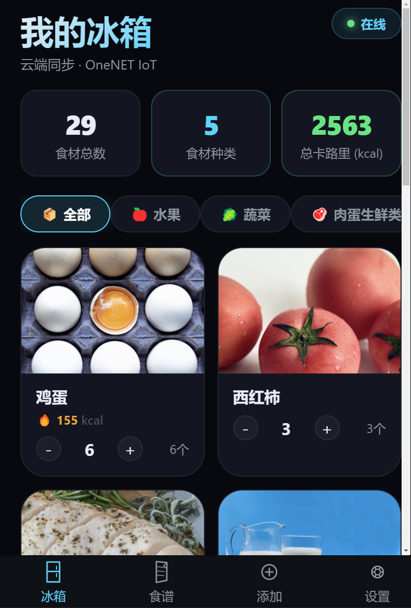
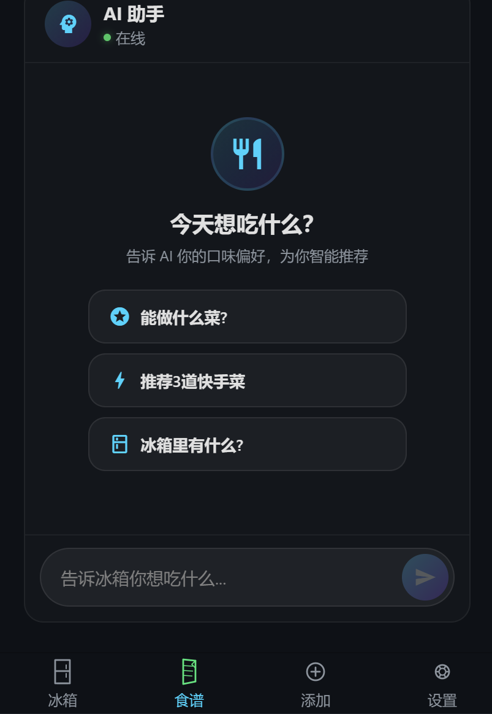
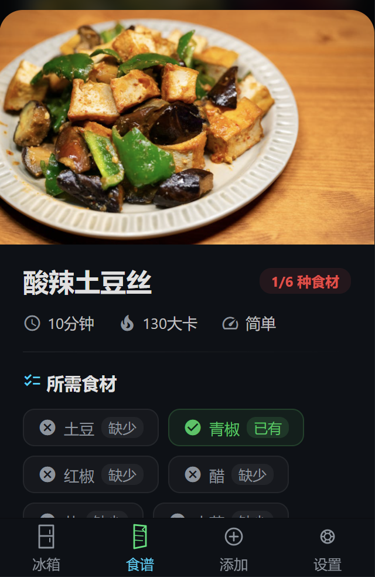
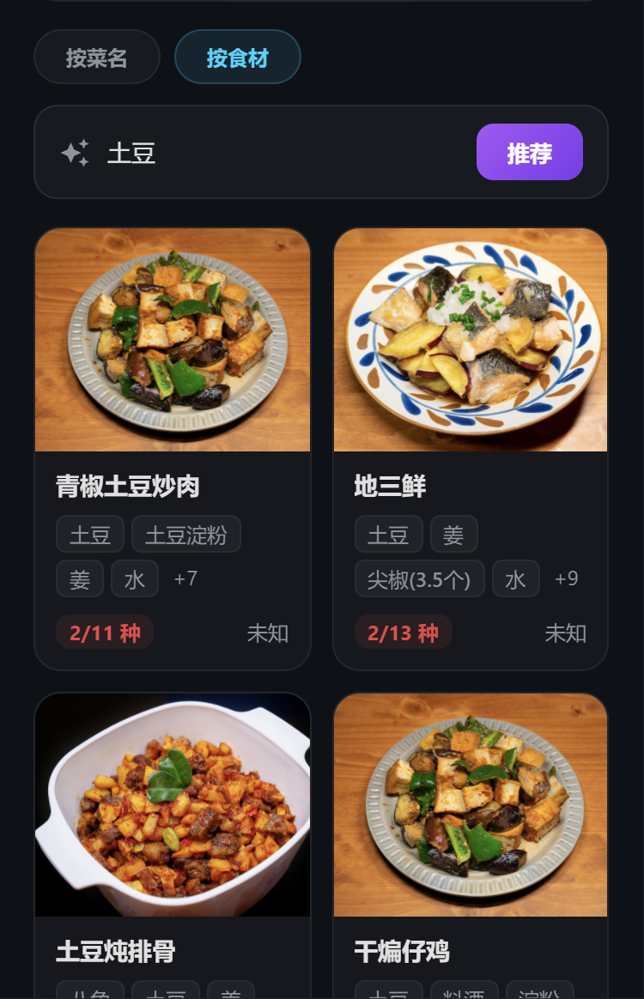
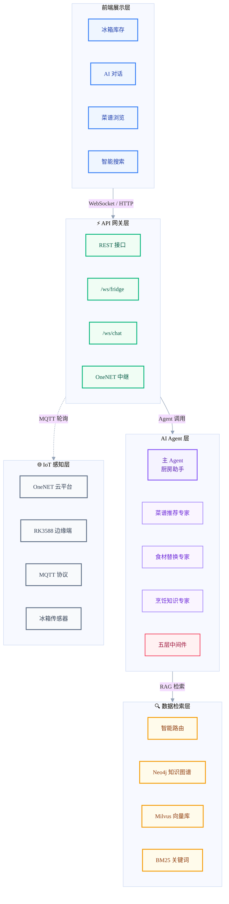
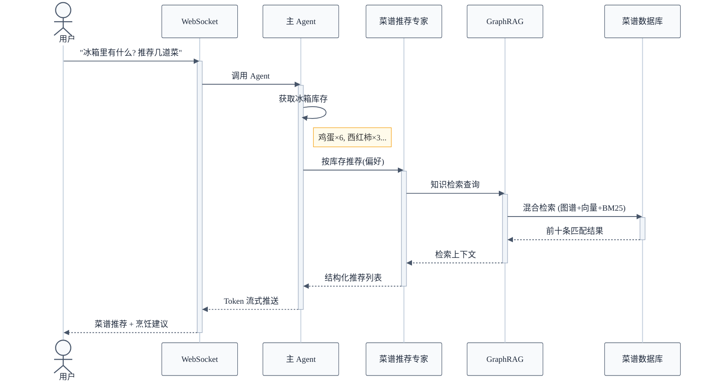
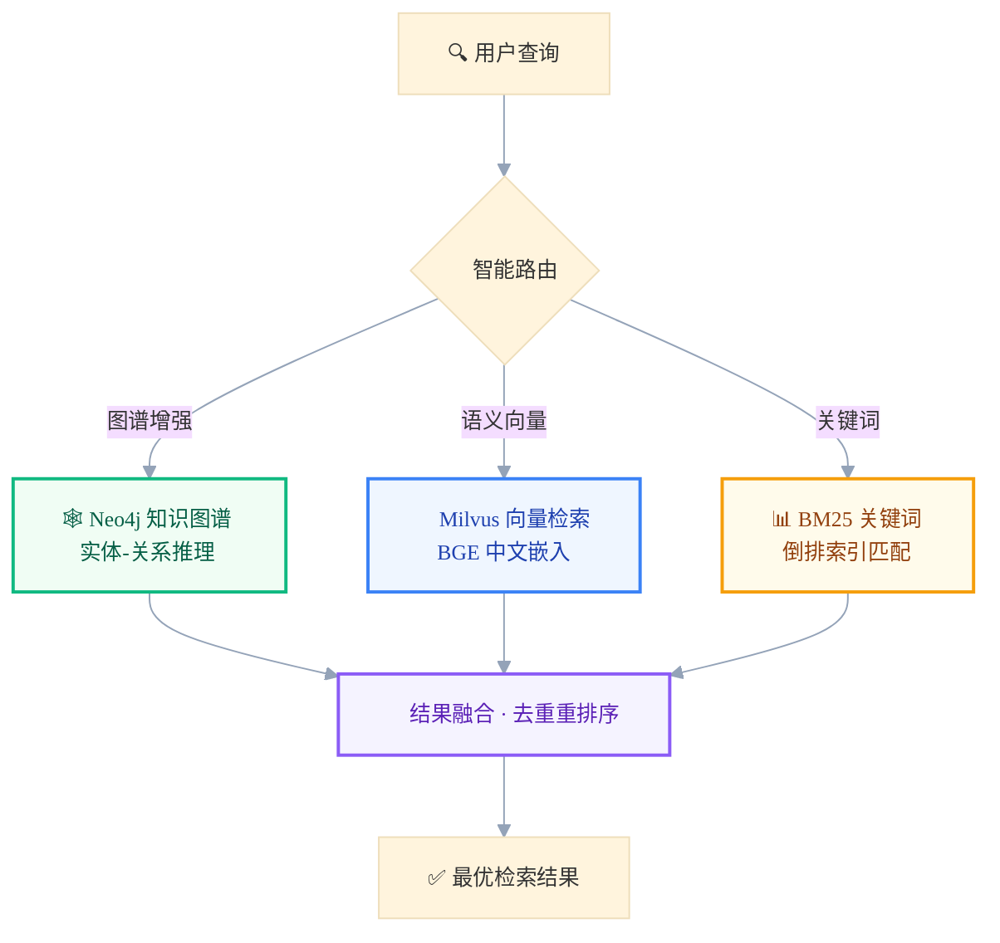
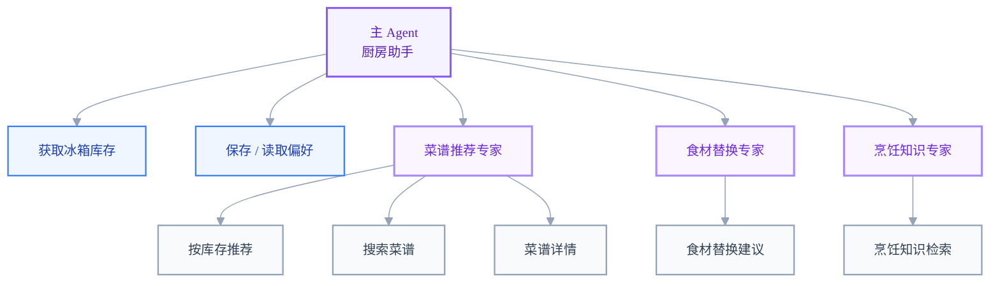

<div align="center">

# 🧊 FridgeAI — 你的 AI 智能厨房助手

**"冰箱里有什么？帮我推荐几道菜" — 一句话，AI 全搞定**

[](https://github.com/silver4444-xs/FridgeApp/stargazers)
[](LICENSE)
[](https://www.python.org/)
[](https://fastapi.tiangolo.com/)
[](https://langchain.com/)
[](https://langchain-ai.github.io/langgraph/)

</div>

---

## 📸 功能演示

<table>
<tr>
  <td align="center" width="25%"><b>🧊 冰箱库存</b></td>
  <td align="center" width="25%"><b>💬 AI 对话</b></td>
  <td align="center" width="25%"><b>📋 菜谱详情</b></td>
  <td align="center" width="25%"><b>🔍 智能搜索</b></td>
</tr>
<tr>
  <td></td>
  <td></td>
  <td></td>
  <td></td>
</tr>
</table>

---

## 📖 项目概述

FridgeAI 是一个开源的全栈 AI 应用，将普通智能冰箱升级为懂你口味的厨房助手。通过 OneNET MQTT 连接 IoT 传感器实时追踪冰箱食材，再结合 **LangGraph 多智能体** 与 **GraphRAG**（Neo4j 知识图谱 + Milvus 向量检索）进行菜谱推荐、食材替换和烹饪问答——全程自然语言对话，像跟大厨聊天一样简单。

> **323 道菜谱** · **12 个分类** · **3 个子 Agent** · **8 个工具** · **GraphRAG 混合检索** · **流式对话** · **移动端优先**

---

## 🚀 快速开始（⏱️ 约 5 分钟）

### 环境要求

| 服务 | 版本 | 是否必须 | 用途 |
|---------|---------|----------|---------|
| Python | 3.12+ | 必须 | 后端运行时 |
| Conda | 任意版本 | 推荐 | 环境管理 |
| Neo4j | 5.x | 必须 | GraphRAG 知识图谱 |
| Milvus | 2.3+ | 必须 | 向量检索 |
| DeepSeek API Key | — | 必须 | 大模型（在 [platform.deepseek.com](https://platform.deepseek.com) 获取） |
| HBuilderX | 最新版 | 前端必须 | uni-app 开发工具 |

### 三步安装

```bash
# ① 克隆项目并安装依赖
git clone https://github.com/silver4444-xs/FridgeApp.git
cd FridgeApp/Backend
conda create -n cook-rag-1 python=3.12 -y && conda activate cook-rag-1
pip install -r requirements.txt

# ② 配置环境变量
cp .env.example .env
# 编辑 .env 填入: DEEPSEEK_API_KEY, NEO4J_URI/PASSWORD, MILVUS_HOST

# ③ 启动服务
uvicorn api.server:app --host 0.0.0.0 --port 8000 --reload
# 浏览器打开 http://localhost:8000/docs 查看 Swagger API 文档
```

**前端：** 用 HBuilderX 打开 `Frontend/` 目录，配置好 API 地址后运行到设备或模拟器。

---

## 🏗️ 系统架构

### 整体架构图



### Agent 对话流程



---

## ✨ 核心功能

### 智能对话

| 功能 | 说明 |
|---------|-------------|
| 🧠 **多 Agent 协作** | 3 个专业子 Agent：菜谱推荐专家、食材替换专家、烹饪知识专家 |
| 💬 **流式对话** | WebSocket 实时 token 推送，打字机效果 |
| 🔄 **人工审批** | 写入操作（保存偏好等）需用户确认后才生效 |
| 📝 **富文本渲染** | 支持表格、分隔线、引用、行内代码、粗体/斜体、菜谱图片注入 |
| 🛡️ **5 层中间件** | 频率限制(15次/轮) → 摘要压缩(4K tokens) → 人工审批 → 模型重试(3次) → 工具重试(2次) |

### 菜谱与食材

| 功能 | 说明 |
|---------|-------------|
| 📚 **323 道菜谱** | 12 个分类：肉类、蔬菜、水产、汤羹、主食、甜点、饮品、早餐等 |
| 🔍 **智能搜索** | 按食材（80+ 同义词组）或菜名搜索，支持模糊匹配 |
| 📋 **菜谱详情** | 分步制作指南、食材标签、小贴士、分类徽章、菜谱图片 |
| 🍳 **食材替换** | 智能替换建议（如黄油 → 橄榄油），大模型推理而非硬编码 |
| ⚡ **实时同步** | OneNET MQTT 接收 IoT 传感器数据 → 冰箱库存自动更新 |

### 知识检索

| 功能 | 说明 |
|---------|-------------|
| 🕸️ **GraphRAG** | Neo4j 知识图谱，支持实体-关系推理，应对复杂烹饪查询 |
| 🔢 **向量检索** | Milvus 语义搜索，使用 BAAI/bge-small-zh-v1.5 中文嵌入模型 |
| 🧭 **智能路由** | 自动选择检索策略：传统混合 / 图谱增强 / 联合检索 |
| 🧪 **评测体系** | 50 条 Ragas 检索质量测试 + 12 条 DeepEval Agent 工具选择测试 |

### 检索路由策略



---

## 🤔 与普通菜谱 App 的区别

普通菜谱 App 靠关键词匹配，FridgeAI 将 **符号知识（Neo4j 图谱）** 与 **语义搜索（Milvus 向量）** 结合，通过 LangGraph Agent 在自然对话中推理你的食材、口味偏好和烹饪约束。

| | 传统菜谱 App | FridgeAI |
|---|:---:|:---:|
| 搜索方式 | 关键词匹配 | GraphRAG + 向量混合检索 |
| 食材感知 | 手动输入 | IoT 自动同步 + 手动补充 |
| 饮食偏好 | 固定筛选 | AI 对话记忆，自动适配 |
| 食材替换 | 无或硬编码 | 大模型智能推理 |
| 烹饪问答 | 静态 FAQ | 流式 Agent + RAG 实时检索 |
| 多轮上下文 | 不支持 | LangGraph checkpointer 持久化 |
| 离线能力 | 依赖网络 | 323 道本地菜谱随时可用 |

---

## 🛠️ 技术栈

| 层级 | 技术 | 版本 | 用途 |
|-------|-----------|---------|---------|
| **AI Agent** | LangChain + LangGraph | 1.3 / 1.2 | Agent 编排、中间件、状态管理 |
| **大模型** | DeepSeek V4 Flash | — | 主力模型（兼容 OpenAI API） |
| **后端** | FastAPI + Uvicorn | 0.115+ | REST API + WebSocket |
| **向量库** | Milvus | 2.3+ | 语义检索，BAAI/bge-small-zh-v1.5 嵌入 |
| **图数据库** | Neo4j | 5.x | 知识图谱，实体-关系推理 |
| **前端** | uni-app (Vue 3) | 3.x | 跨平台移动应用（iOS/Android/Web/小程序） |
| **IoT 平台** | OneNET + MQTT | — | 冰箱传感器实时数据 |
| **边缘端** | RK3588 | — | 设备端 MQTT 客户端，传感器采集 |
| **嵌入模型** | sentence-transformers | 5.3 | BAAI/bge-small-zh-v1.5（中文优化） |
| **评测工具** | Ragas + DeepEval | 0.4.3 | RAG 检索质量 + Agent 工具选择测试 |
| **可观测性** | LangSmith | 0.3+ | LLM 链路追踪与监控 |

---

## 🔧 Agent 工具

| 工具 | 运行时 | 说明 |
|------|---------|-------------|
| `get_fridge_inventory` | context | 读取冰箱食材清单 |
| `recommend_by_fridge` | context | 基于库存推荐菜谱（支持忌口过滤） |
| `search_recipes_by_ingredients` | — | 按食材精确搜索菜谱 |
| `get_recipe_detail` | — | 获取菜谱完整详情 |
| `find_substitutions` | — | 食材替换建议 |
| `search_cooking_knowledge` | — | RAG 烹饪知识问答 |
| `save_user_preferences` | context+store | 持久化用户偏好 |
| `get_user_preferences` | context+store | 读取已保存的偏好 |

## 🤖 子 Agent

| 子 Agent | 携带工具 | 说明 |
|-----------|-------|-------------|
| `recipe_expert` | recommend_by_fridge + search_recipes + get_detail | 菜谱推荐（结构化输出） |
| `substitution_expert` | find_substitutions | 食材替换（temperature=0.0 确保一致性） |
| `cooking_expert` | search_cooking_knowledge | 烹饪知识 RAG 检索 |

## 🛡️ 中间件栈


### Agent-工具关系



---

## 📡 API 接口

### WebSocket `/ws/fridge`

| 消息类型 | 方向 | 说明 |
|------|-----------|-------------|
| `food_update` | 后端→前端 | 全量库存推送 |
| `food_upload` | 前端→后端 | 前端上传食材 |
| `ack` | 后端→前端 | 上传已入队 |
| `upload_status` | 后端→前端 | 上传状态通知 |

### WebSocket `/ws/chat`

| 消息类型 | 方向 | 说明 |
|------|-----------|-------------|
| `chat` | 前端→后端 | 用户消息 |
| `stream_token` | 后端→前端 | LLM token 打字机推送 |
| `stream_tool_start` | 后端→前端 | 工具调用开始 |
| `stream_tool_end` | 后端→前端 | 工具调用完成 |
| `stream_tool_error` | 后端→前端 | 工具调用出错 |
| `stream_done` | 后端→前端 | 响应结束 |

### REST 接口

| 方法 | 路径 | 说明 |
|--------|------|-------------|
| `GET` | `/api/recommend` | 获取菜谱推荐 |
| `GET` | `/api/search` | 按菜名或食材搜索 |
| `GET` | `/api/recipe/{id}` | 获取菜谱详情 |
| `GET` | `/api/substitutions` | 查找食材替换方案 |
| `POST` | `/api/chat` | REST 方式访问 AI 对话（兜底） |

---

## 📁 目录结构

```
FridgeApp/
├── Frontend/                       # uni-app 移动端
│   ├── pages/
│   │   ├── home/home.vue           # 冰箱库存管理
│   │   ├── recipes/recipes.vue     # AI 推荐 + 对话
│   │   ├── add/add.vue             # 添加食材
│   │   └── settings/settings.vue   # 设置 — IP 配置
│   └── utils/
│       ├── store.js                # 响应式数据中心
│       ├── cloudSync.js            # OneNET WS 数据同步
│       ├── agentChat.js            # Agent 流式对话客户端
│       └── imageResolver.js        # 5 级图片回退策略
│
├── Backend/
│   ├── api/
│   │   ├── server.py               # FastAPI 入口 + lifespan 启动流程
│   │   ├── dependencies.py         # 全局单例（7 个）
│   │   ├── onenet_relay.py         # OneNET HTTP 轮询 + 上传队列
│   │   ├── ws_relay.py             # /ws/fridge 数据推送
│   │   ├── chat_relay.py           # /ws/chat Agent 流式处理
│   │   ├── tools.py                # 8 个 @tool + FridgeContext
│   │   ├── subagents.py            # 3 个专业子 Agent
│   │   ├── graph.py                # LangGraph StateGraph
│   │   ├── models.py               # Pydantic 数据模型
│   │   └── routes/                 # REST 路由
│   ├── matching/                   # 倒排索引 + 模糊匹配
│   ├── rag_modules/                # Neo4j + Milvus + 混合检索
│   ├── prompts/                    # ChatPromptTemplate 提示词模板
│   ├── tests/                      # 单元 + Ragas + DeepEval 测试
│   ├── main.py                     # RAG 系统初始化 + Agent 工厂函数
│   └── config.py                   # GraphRAGConfig 全局配置
│
└── docs/                           # 项目文档
```

---

## Agent 调用示例

```python
from api.dependencies import get_fridge_agent
from api.tools import FridgeContext

agent = get_fridge_agent()
result = agent.invoke(
    {"messages": [{"role": "user", "content": "能做什么菜?"}]},
    context=FridgeContext(
        current_inventory=[{"name":"鸡蛋","qty":6,"cal":74,"cat":"肉蛋生鲜类"}],
        user_preferences={"忌口":["花生"]},
        user_id="user_001",
    ),
)

# 多轮对话（thread_id 保持上下文连续）
from api.dependencies import get_fridge_graph
graph = get_fridge_graph()
config = {"configurable": {"thread_id": "user_001"}}
graph.invoke({"messages": [...]}, config=config)  # 第二轮自动继承上下文
```

---

## ❓ 常见问题

<details>
<summary><b>和普通菜谱 App 有什么不同？</b></summary>

FridgeAI 用 AI Agent + GraphRAG 理解你的食材和偏好，以自然语言交互。不需要搜关键词，直接说"有什么不加奶的菜？"，Agent 会自动推理替换方案和饮食约束。
</details>

<details>
<summary><b>用什么大模型？能换吗？</b></summary>

默认使用 DeepSeek V4 Flash（兼容 OpenAI API 格式）。在 `.env` 中修改 `OPENAI_API_BASE` 和模型名即可切换到 GPT-4、Claude（通过代理）、本地模型等任何兼容接口。
</details>

<details>
<summary><b>没网络能用吗？</b></summary>

323 道本地菜谱离线可用。AI 对话和 RAG 检索需要联网（DeepSeek API）。IoT 数据同步需要 OneNET 连接。
</details>

<details>
<summary><b>怎么添加自己的菜谱？</b></summary>

参照模板格式，在 `Backend/data/dishes/` 和 `Frontend/data/dishes/` 下添加 Markdown 文件，重启服务后自动索引。
</details>

<details>
<summary><b>能用于生产环境吗？</b></summary>

目前处于活跃开发阶段（Phase 8 已完成）。
</details>


## 🤝 参与贡献

欢迎贡献代码！步骤：

1. Fork 本仓库
2. 创建功能分支 (`git checkout -b feat/你的功能`)
3. 提交修改 (`git commit -m 'feat: 添加某某功能'`)
4. 推送到分支 (`git push origin feat/你的功能`)
5. 提交 Pull Request

详见 [CONTRIBUTING.md](CONTRIBUTING.md)。

## 📄 许可证

MIT © FridgeAI Contributors — 详见 [LICENSE](LICENSE)。
