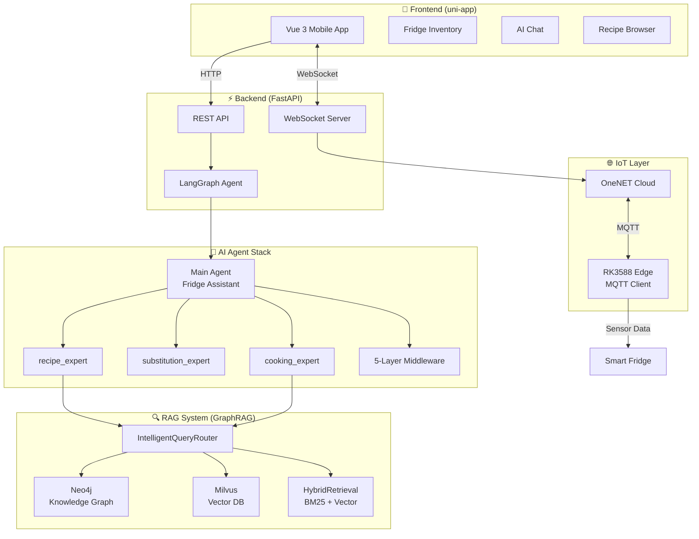
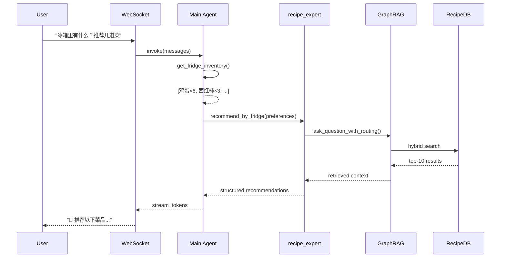

<div align="center">

# 🧊 FridgeAI — AI-Powered Smart Fridge & Recipe Recommendation System

**An intelligent kitchen assistant powered by LangGraph Agents, GraphRAG (Neo4j), and Vector Search (Milvus).**

[](https://github.com/silver4444-xs/FridgeApp/stargazers)
[](https://github.com/silver4444-xs/FridgeApp/network/members)
[](LICENSE)
[](https://www.python.org/)
[](https://fastapi.tiangolo.com/)
[](https://langchain.com/)
[](https://langchain-ai.github.io/langgraph/)

</div>

---

## 📖 Overview / 项目概述

**EN:** FridgeAI is a full-stack AI application that turns a smart fridge into an intelligent kitchen assistant. It connects to IoT sensors via OneNET MQTT to track ingredients in real-time, then uses LangGraph-powered AI agents with GraphRAG (Neo4j knowledge graph + Milvus vector database) to recommend recipes, suggest ingredient substitutions, and answer cooking questions — all through a natural conversational interface.

**CN:** FridgeAI 是一个全栈 AI 应用，将智能冰箱变成厨房助手。通过 OneNET MQTT 连接 IoT 传感器实时追踪食材，使用 LangGraph 驱动的 AI Agent 结合 GraphRAG (Neo4j 知识图谱 + Milvus 向量数据库) 进行菜谱推荐、食材替换建议和烹饪问答——全部通过自然语言对话界面完成。

> **323 recipes** · **12 categories** · **3 AI sub-agents** · **GraphRAG retrieval** · **Streaming chat** · **Mobile-first UI**

---

## 🎬 Quick Demo / 快速演示

> 📸 Screenshots coming soon. In the meantime, here's what you can do:

| 🧊 **Fridge Inventory** | 💬 **AI Chat** | 📋 **Recipe Detail** | 🔍 **Smart Search** |
|:---:|:---:|:---:|:---:|
| Real-time IoT sync | Streaming Agent | Step-by-step guide | GraphRAG-powered |
| Auto-polling from OneNET | Token-level typewriter | Ingredient tags + tips | BM25 + Vector hybrid |
| Manual add/edit/delete | Tool call progress | Category badges + images | 80+ synonym groups |

---

## 🚀 Quick Start / 快速开始

### Prerequisites / 环境要求

| Service | Version | Required | Purpose |
|---------|---------|----------|---------|
| Python | 3.12+ | Required | Backend runtime |
| Conda | any | Recommended | Environment management |
| Neo4j | 5.x | Required | GraphRAG knowledge graph |
| Milvus | 2.3+ | Required | Vector search & retrieval |
| DeepSeek API Key | — | Required | LLM (get at [platform.deepseek.com](https://platform.deepseek.com)) |
| HBuilderX | latest | Required (frontend) | uni-app IDE |

### 3-Step Setup / 三步安装

```bash
# 1. Clone & install dependencies
git clone https://github.com/silver4444-xs/FridgeApp.git
cd FridgeApp/Backend
conda create -n cook-rag-1 python=3.12 -y && conda activate cook-rag-1
pip install -r requirements.txt

# 2. Set environment variables
cp .env.example .env
# Edit .env: add DEEPSEEK_API_KEY, NEO4J_URI/PASSWORD, MILVUS_HOST

# 3. Start the server
uvicorn api.server:app --host 0.0.0.0 --port 8000 --reload
# Open http://localhost:8000/docs for Swagger API docs
```

**Frontend:** Open `Frontend/` in HBuilderX, configure the API base URL, and run on device/emulator.

---

## 🏗️ Architecture / 系统架构

### System Overview / 系统总览



### Agent Workflow / Agent 工作流



---

## ✨ Features / 核心功能

### AI Agent / 智能对话

| Feature | Description |
|---------|-------------|
| 🧠 **Multi-Agent Architecture** | 3 specialized sub-agents: recipe expert, substitution expert, cooking knowledge expert |
| 💬 **Streaming Chat** | Real-time token streaming via WebSocket with typing indicators |
| 🔄 **HITL Approval** | Human-in-the-loop interrupt for preference saving — user must approve before changes persist |
| 📝 **Rich Markdown** | Tables, dividers, blockquotes, inline code, bold/italic, recipe image injection |
| 🛡️ **5-Layer Middleware** | Rate limit (15/run), summarization (4K tokens), HITL, model retry (3x), tool retry (2x) |

### Recipe & Food / 菜谱与食材

| Feature | Description |
|---------|-------------|
| 📚 **323 Recipes** | 12 categories: meat, vegetable, seafood, soup, staple, dessert, drink, breakfast, etc. |
| 🔍 **Smart Search** | Search by ingredient (80+ synonym groups) or recipe name with fuzzy matching |
| 📋 **Recipe Detail** | Step-by-step guide, ingredient tags, tips, category badges, recipe images |
| 🍳 **Substitution** | Intelligent ingredient substitution suggestions (e.g., butter → olive oil) |
| ⚡ **Real-time Sync** | IoT sensor data via OneNET MQTT → fridge inventory auto-update |

### RAG & Knowledge / 知识检索

| Feature | Description |
|---------|-------------|
| 🕸️ **GraphRAG** | Neo4j knowledge graph with entity-relation retrieval for complex cooking queries |
| 🔢 **Vector Search** | Milvus-powered semantic search with BAAI/bge-small-zh-v1.5 embeddings |
| 🧭 **Intelligent Routing** | Auto-select retrieval strategy: hybrid_traditional / graph_rag / combined |
| 🧪 **Evaluation Framework** | 50 Ragas test cases + 12 DeepEval agent tool-selection tests |

---

## 🤔 Why FridgeAI? / 为什么选择 FridgeAI?

Unlike simple recipe apps that use keyword matching, FridgeAI combines **symbolic knowledge (Neo4j graph)** with **semantic search (Milvus vectors)** through a LangGraph agent that can reason about your ingredients, preferences, and cooking constraints in natural conversation.

| | Traditional Recipe Apps | FridgeAI |
|---|:---:|:---:|
| Search method | Keyword match | GraphRAG + Vector hybrid |
| Ingredient awareness | Manual input | IoT auto-sync + manual |
| Dietary preferences | Rigid filters | Conversational AI memory |
| Ingredient substitution | None or hardcoded | LLM-powered reasoning |
| Cooking Q&A | Static FAQ | Streaming Agent with RAG |
| Multi-turn context | None | LangGraph checkpointer |
| Offline capability | None | 323 local recipes |

---

## 🛠️ Tech Stack / 技术栈

| Layer | Technology | Version | Purpose |
|-------|-----------|---------|---------|
| **AI Agent** | LangChain + LangGraph | 1.3 / 1.2 | Agent orchestration, middleware, state management |
| **LLM** | DeepSeek V4 Flash | — | Primary LLM (via OpenAI-compatible API) |
| **Backend** | FastAPI + Uvicorn | 0.115+ | REST API + WebSocket server |
| **Vector DB** | Milvus | 2.3+ | Semantic search, BAAI/bge-small-zh-v1.5 embeddings |
| **Graph DB** | Neo4j | 5.x | Knowledge graph, entity-relation reasoning |
| **Frontend** | uni-app (Vue 3) | 3.x | Cross-platform mobile app (iOS/Android/Web/MiniApp) |
| **IoT** | OneNET Cloud + MQTT | — | Real-time fridge sensor data sync |
| **Edge** | RK3588 | — | On-device MQTT client, sensor data collection |
| **Embeddings** | sentence-transformers | 5.3 | BAAI/bge-small-zh-v1.5 (Chinese-optimized) |
| **Evaluation** | Ragas + DeepEval | 0.4.3 | RAG retrieval quality + Agent tool selection testing |
| **Observability** | LangSmith | 0.3+ | LLM tracing and monitoring |

---

## 🔧 Agent Tools / Agent 工具

| Tool | Runtime | Description |
|------|---------|-------------|
| `get_fridge_inventory` | context | Read fridge ingredient list |
| `recommend_by_fridge` | context | Recommend recipes based on inventory (with dietary filtering) |
| `search_recipes_by_ingredients` | — | Explicit ingredient search |
| `get_recipe_detail` | — | Full recipe details |
| `find_substitutions` | — | Ingredient substitution suggestions |
| `search_cooking_knowledge` | — | RAG cooking knowledge Q&A |
| `save_user_preferences` | context+store | Persist user preferences |
| `get_user_preferences` | context+store | Read saved preferences |

## 🤖 Sub-Agents / 子 Agent

| Sub-Agent | Tools | Description |
|-----------|-------|-------------|
| `recipe_expert` | recommend_by_fridge + search_recipes + get_detail | Recipe recommendation (Structured Output) |
| `substitution_expert` | find_substitutions | Ingredient substitution (temperature=0.0) |
| `cooking_expert` | search_cooking_knowledge | Cooking knowledge RAG |

## 🛡️ Middleware Stack

```
1. ModelCallLimitMiddleware   max 15 model calls per run
2. SummarizationMiddleware    auto-summarize when >4000 tokens
3. HumanInTheLoopMiddleware   write operations require approval
4. ModelRetryMiddleware       LLM API fault tolerance (3 retries, exponential backoff)
5. ToolRetryMiddleware        Tool fault tolerance (2 retries)
```

---

## 📡 API Reference / 接口参考

### WebSocket `/ws/fridge`

| Type | Direction | Description |
|------|-----------|-------------|
| `food_update` | B→F | Full inventory push |
| `food_upload` | F→B | Frontend upload |
| `ack` | B→F | Upload queued |
| `upload_status` | B→F | Upload status |

### WebSocket `/ws/chat`

| Type | Direction | Description |
|------|-----------|-------------|
| `chat` | F→B | User message |
| `stream_token` | B→F | LLM token (typewriter) |
| `stream_tool_start` | B→F | Tool call started |
| `stream_tool_end` | B→F | Tool call completed |
| `stream_tool_error` | B→F | Tool call error |
| `stream_done` | B→F | Response complete |

### REST Endpoints

| Method | Path | Description |
|--------|------|-------------|
| `GET` | `/api/recommend` | Get recipe recommendations |
| `GET` | `/api/search` | Search recipes by name or ingredients |
| `GET` | `/api/recipe/{id}` | Get recipe detail |
| `GET` | `/api/substitutions` | Find ingredient substitutions |
| `POST` | `/api/chat` | REST fallback for AI chat |

---

## 📁 Project Structure / 目录结构

```
FridgeApp/
├── Frontend/                       # uni-app mobile app
│   ├── pages/
│   │   ├── home/home.vue           # Fridge inventory management
│   │   ├── recipes/recipes.vue     # AI recommendation + chat
│   │   ├── add/add.vue             # Add ingredients
│   │   └── settings/settings.vue   # Settings — IP config
│   └── utils/
│       ├── store.js                # Reactive data center
│       ├── cloudSync.js            # OneNET WS data sync
│       ├── agentChat.js            # Agent streaming chat client
│       └── imageResolver.js        # 5-level image fallback
│
├── Backend/
│   ├── api/
│   │   ├── server.py               # FastAPI entry + lifespan
│   │   ├── dependencies.py         # Global singletons (7 items)
│   │   ├── onenet_relay.py         # OneNET HTTP polling + upload queue
│   │   ├── ws_relay.py             # /ws/fridge data push
│   │   ├── chat_relay.py           # /ws/chat Agent streaming
│   │   ├── tools.py                # 8 @tool + FridgeContext
│   │   ├── subagents.py            # 3 specialized sub-agents
│   │   ├── graph.py                # LangGraph StateGraph
│   │   ├── models.py               # Pydantic data models
│   │   └── routes/                 # REST endpoints
│   ├── matching/                   # Inverted index + fuzzy matching
│   ├── rag_modules/                # Neo4j + Milvus + Hybrid RAG
│   ├── prompts/                    # ChatPromptTemplate templates
│   ├── tests/                      # Unit + Ragas + DeepEval tests
│   ├── main.py                     # RAG system + Agent factory
│   └── config.py                   # GraphRAGConfig
│
└── docs/                           # Design documents
```

---

## Agent 调用示例

```python
from api.dependencies import get_fridge_agent
from api.tools import FridgeContext

agent = get_fridge_agent()
result = agent.invoke(
    {"messages": [{"role": "user", "content": "能做什么菜?"}]},
    context=FridgeContext(
        current_inventory=[{"name":"鸡蛋","qty":6,"cal":74,"cat":"肉蛋生鲜类"}],
        user_preferences={"忌口":["花生"]},
        user_id="user_001",
    ),
)

# Multi-turn conversation (thread_id preserves history)
from api.dependencies import get_fridge_graph
graph = get_fridge_graph()
config = {"configurable": {"thread_id": "user_001"}}
graph.invoke({"messages": [...]}, config=config)  # Round 2 inherits context
```

---

## ❓ FAQ / 常见问题

<details>
<summary><b>How is this different from a regular recipe app? / 这和普通菜谱 App 有什么不同？</b></summary>

FridgeAI uses AI agents with GraphRAG to understand your ingredients and preferences in natural language. Instead of searching by keyword, you can say "what can I make without dairy?" and the agent reasons about substitutions and constraints.
</details>

<details>
<summary><b>What LLM does it use? Can I switch models? / 用什么大模型？能换吗？</b></summary>

Default: DeepSeek V4 Flash via OpenAI-compatible API. You can switch to any OpenAI-compatible model (GPT-4, Claude via proxy, local models) by changing `OPENAI_API_BASE` and model name in `.env`.
</details>

<details>
<summary><b>Does it work without internet? / 没网络能用吗？</b></summary>

The 323 local recipes are always available offline. AI chat and RAG retrieval require internet (DeepSeek API). The IoT sync requires OneNET connectivity.
</details>

<details>
<summary><b>How do I add my own recipes? / 怎么添加自己的菜谱？</b></summary>

Add Markdown files to `Backend/data/dishes/` and `Frontend/data/dishes/` following the template format. They'll be indexed on next server restart.
</details>

<details>
<summary><b>Is it production-ready? / 能用于生产环境吗？</b></summary>

Currently in active development (Phase 8 completed). Known P0 issues: hardcoded credentials, in-memory state storage (lost on restart). See [Known Limitations](#%EF%B8%8F-known-limitations--%E5%B7%B2%E7%9F%A5%E9%99%90%E5%88%B6).
</details>

---

## ⚠️ Known Limitations / 已知限制

- `InMemorySaver`/`InMemoryStore` lose data on restart → production needs `PostgresSaver`/`PostgresStore`
- Hardcoded credentials in `onenet_relay.py` — needs env var migration
- No Docker/CI-CD — planned for Phase 9
- Pipe delimiter `|` and `;` in ingredient names may conflict with parsing

---

## ⭐ Star History / 星标历史

[](https://star-history.com/#silver4444-xs/FridgeApp&Date)

## 🤝 Contributing / 参与贡献

Contributions are welcome! Please:

1. Fork the repository
2. Create a feature branch (`git checkout -b feat/amazing-feature`)
3. Commit your changes (`git commit -m 'feat: add amazing feature'`)
4. Push to the branch (`git push origin feat/amazing-feature`)
5. Open a Pull Request

See [CONTRIBUTING.md](CONTRIBUTING.md) for detailed guidelines and [CLAUDE.md](CLAUDE.md) for development notes.

## 📄 License / 许可证

MIT © FridgeAI Contributors — see [LICENSE](LICENSE) for details.
