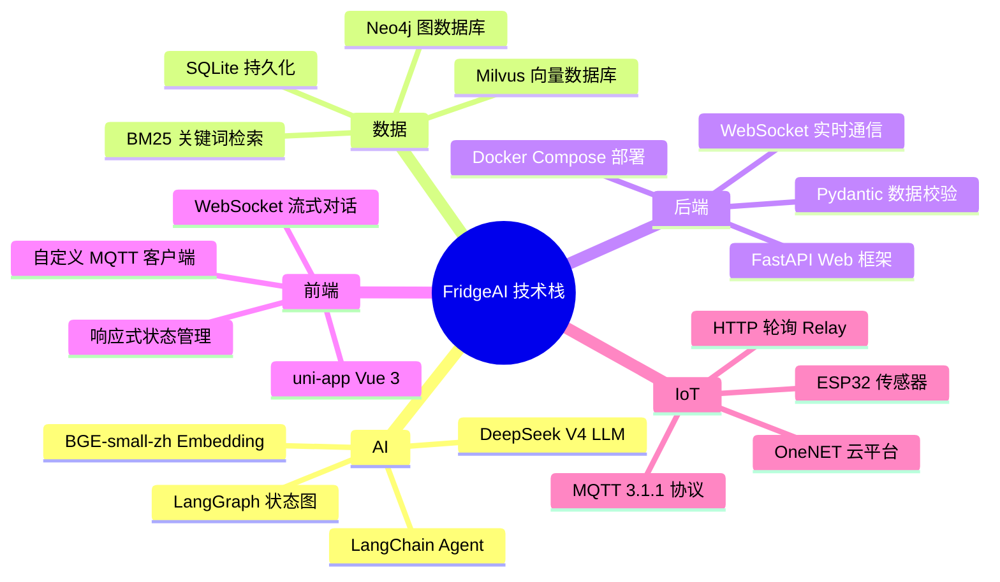
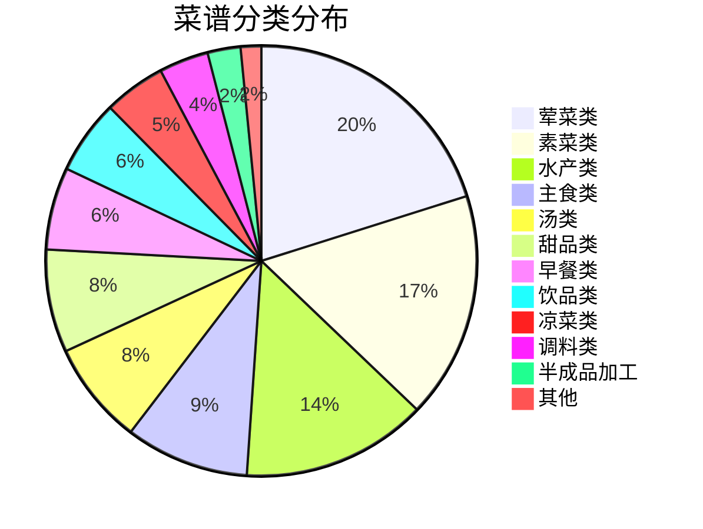
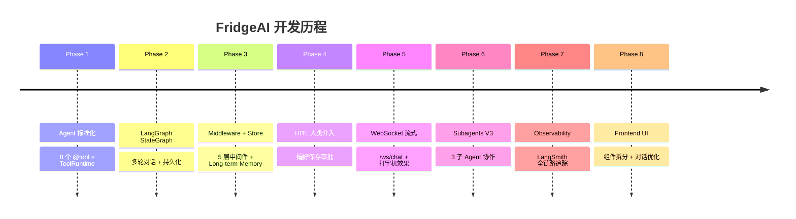

# 项目概览

> FridgeAI — 智能冰箱食材管理与菜谱推荐系统

## 项目简介

FridgeAI 是一个基于 AI 的智能冰箱系统，通过物联网传感器实时监控冰箱食材，结合 GraphRAG 知识图谱和大语言模型，为用户提供个性化的菜谱推荐和烹饪指导。

**核心价值**：解决"冰箱里有什么？能做什么菜？缺的食材用什么替代？"三个核心问题。

## 功能矩阵

| 功能 | 说明 | 技术实现 |
|------|------|---------|
| 食材管理 | 实时监控冰箱食材，自动分类、卡路里估算 | OneNET IoT + 模糊匹配 |
| 智能推荐 | 基于现有食材推荐可制作菜谱 | 倒排索引 + 同义词匹配 |
| AI 对话 | 自然语言交互，流式打字机效果 | LangChain Agent + WebSocket |
| 食材替换 | 缺少食材时智能推荐替代方案 | LLM 推理 + 烹饪知识库 |
| 烹饪知识 | 回答技巧、食材处理等开放问题 | GraphRAG 多跳推理 |
| 多轮对话 | 上下文记忆、指代消解 | LangGraph + SQLite 持久化 |
| 偏好记忆 | 记住用户忌口、偏好菜系 | Long-term Memory Store |
| 云端同步 | 多设备数据同步 | OneNET 云平台 |
| 跨平台 | H5/Android/微信小程序 | uni-app |

## 技术栈

## 菜谱数据分布

323 道菜谱，12 个分类：

## 开发阶段

## 与同类产品对比

| 能力 | 传统菜谱 App | ChatGPT | FridgeAI |
|------|-------------|---------|----------|
| 自动获取冰箱食材 | 不支持 | 不支持 | **支持** (IoT) |
| 实时食材匹配 | 不支持 | 需手动输入 | **支持** (倒排索引) |
| 食材模糊匹配 | 关键词 | 语义理解 | **两者结合** |
| 多轮对话记忆 | 无 | 有限 | **支持** (LangGraph) |
| 知识图谱推理 | 无 | 无 | **支持** (Neo4j) |
| 食材替代建议 | 不支持 | 通用建议 | **专业建议** |
| 偏好持久化 | 部分 | 不支持 | **支持** (Store) |
| 离线可用 | 不支持 | 不支持 | **支持** (本地匹配) |

## 关键指标

| 指标 | 数值 |
|------|------|
| 菜谱数量 | 323 道 |
| 食材种类 | 500+ |
| 同义词对 | 120+ |
| Agent 工具 | 6 个 (主) + 3 子 Agent |
| REST 端点 | 6 个 |
| WebSocket 端点 | 2 个 |
| 中间件层 | 5 层 |
| 检索策略 | 3 种 (智能路由) |
| 图查询类型 | 5 种 |
| 推荐响应时间 | < 1ms (本地匹配) |
| RAG 响应时间 | 1-3s (含 LLM 生成) |
