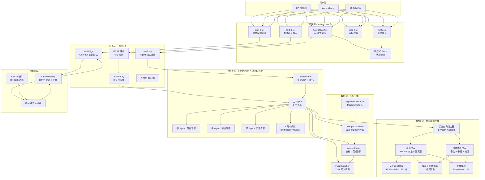
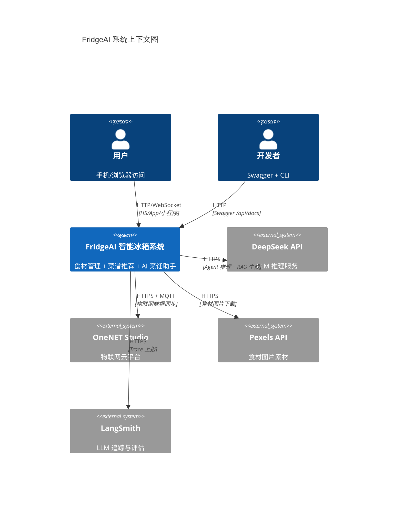
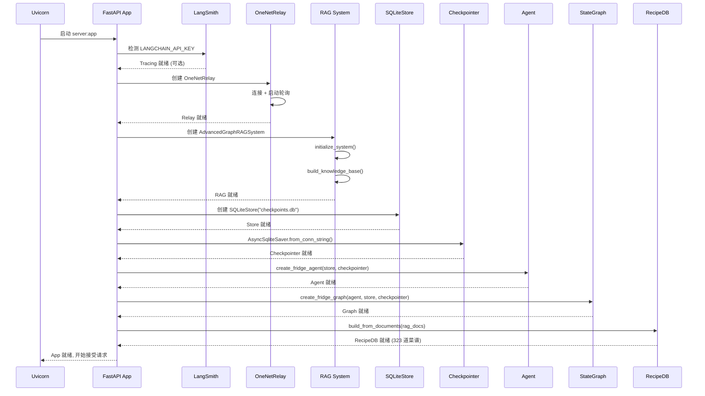

# 系统架构

> FridgeAI 完整系统架构 — 6 层设计详解

## 架构全景图

FridgeAI 采用 **6 层分层架构**，从底层数据到顶层用户界面，每层职责清晰：

## 系统上下文图

## 启动时序图

系统启动时，FastAPI lifespan 按顺序初始化 7 个组件：

## 数据流全景

从物联网传感器到用户看到菜谱推荐的完整数据链路：

```mermaid
flowchart LR
    subgraph 硬件["硬件层"]
        ESP["ESP32 传感器"]
    end

    subgraph 云["OneNET 云"]
        CLOUD["OneNET Studio<br/>设备属性存储"]
    end

    subgraph 后端["FridgeAI 后端"]
        RELAY["OneNetRelay<br/>HTTP 轮询 0.5s"]
        PARSE["数据解析<br/>管道格式 → JSON"]
        BROAD["WS Relay<br/>广播推送"]
        INV["冰箱库存<br/>current_inventory"]
        AG["Agent<br/>上下文注入"]
        RCMD["推荐引擎<br/>倒排索引匹配"]
    end

    subgraph 前端["用户端"]
        UI["uni-app<br/>食材卡片 + 菜谱列表"]
        CHAT["AI 对话<br/>流式打字机"]
    end

    ESP -- "MQTT" --> CLOUD
    CLOUD -- "HTTP API" --> RELAY
    RELAY --> PARSE --> INV
    INV --> BROAD -- "/ws/fridge" --> UI
    INV --> AG
    AG --> RCMD
    UI -- "/ws/chat" --> CHAT
    CHAT --> AG
    RCMD --> UI

    style INV fill:#0d1117,stroke:#00d4ff
    style AG fill:#0d1117,stroke:#a371f7
    style RCMD fill:#0d1117,stroke:#3fb950
```

## 6 层架构详解

### 第 1 层：数据层（匹配引擎）

| 组件 | 文件 | 说明 |
|------|------|------|
| `RecipeDatabase` | `matching/recipe_database.py` | 内存常驻菜谱库, `Dict[id, Dict]`, 323 道 |
| `InvertedIndex` | `matching/inverted_index.py` | `食材名 → Set[菜谱ID]`, O(1) 查找 |
| `FuzzyMatcher` | `matching/fuzzy_matcher.py` | 食材归一化 + 120+ 同义词对 |
| `IngredientExtractor` | `matching/ingredient_extractor.py` | HowToCook Markdown → 结构化食材 |

**核心能力**：毫秒级食材到菜谱的匹配，支持模糊匹配和同义词扩展。

### 第 2 层：RAG 层（检索增强生成）

| 组件 | 文件 | 说明 |
|------|------|------|
| `IntelligentQueryRouter` | `rag_modules/intelligent_query_router.py` | 3 种策略自动路由 |
| `HybridRetrievalModule` | `rag_modules/hybrid_retrieval.py` | BM25 + 向量 + 图索引融合 |
| `GraphRAGRetrieval` | `rag_modules/graph_rag_retrieval.py` | Neo4j 多跳/子图/路径查询 |
| `MilvusIndexConstruction` | `rag_modules/milvus_index_construction.py` | BGE-small-zh 向量化 + HNSW |
| `GraphDataPreparation` | `rag_modules/graph_data_preparation.py` | Neo4j 图数据写入 |
| `GenerationIntegration` | `rag_modules/generation_integration.py` | DeepSeek LLM 答案生成 |

**核心能力**：混合检索（关键词 + 语义 + 图结构），智能路由选择最优策略。

### 第 3 层：Agent 层（智能代理）

| 组件 | 文件 | 说明 |
|------|------|------|
| 主 Agent | `main.py` → `create_fridge_agent()` | 6 工具 + 5 中间件 |
| LangGraph | `api/graph.py` | StateGraph + HITL + 持久化 |
| 3 个子 Agent | `api/subagents.py` | 菜谱/替换/烹饪专家 |
| 8 个 Tool | `api/tools.py` | 冰箱查询/推荐/详情/替换/搜索/偏好 |

**核心能力**：多 Agent 协作、HITL 人类介入、流式输出。

### 第 4 层：API 层（FastAPI）

| 端点 | 协议 | 说明 |
|------|------|------|
| `/api/recipes/recommend` | POST | 菜谱推荐 |
| `/api/recipes/search` | GET | 菜谱搜索 |
| `/api/recipes/{id}` | GET | 菜谱详情 |
| `/api/recipes/{id}/suggest-substitutions` | POST | 食材替换 |
| `/api/chat` | POST | 非流式对话 |
| `/ws/fridge` | WebSocket | OneNET 数据推送 |
| `/ws/chat` | WebSocket | Agent 流式对话 |
| `/api/health` | GET | 健康检查 |

### 第 5 层：前端层（uni-app）

基于 Vue 3 响应式系统，4 个 tab 页面 + 3 个 WebSocket 连接：

| 页面 | 说明 |
|------|------|
| `pages/home/home.vue` | 冰箱库存管理 |
| `pages/recipes/recipes.vue` | 菜谱推荐 + AI 对话 |
| `pages/add/add.vue` | 食材录入 + 自动分类 |
| `pages/settings/settings.vue` | 连接配置 |

### 第 6 层：物联网层

| 组件 | 说明 |
|------|------|
| OneNET Studio | 物联网云平台 |
| `OneNetRelay` | HTTP 轮询 (0.5s) + 上传队列 + 死信 |
| `ws_relay` | WebSocket 广播推送 |
| `mqttClient.js` | 前端直连 MQTT 备选路径 |
| ESP32 / RK3588 | 硬件设备端 |

## 关键技术决策

| 决策 | 选型 | 原因 |
|------|------|------|
| Agent 框架 | LangChain + LangGraph | 内置 checkpointer/store, HITL 支持 |
| 向量数据库 | Milvus | HNSW 索引, 支持 Lite 嵌入式模式 |
| 图数据库 | Neo4j Community | 菜谱知识图谱天然适合图结构 |
| Embedding | BGE-small-zh (512d) | 中文优化, 轻量 (< 100MB) |
| LLM | DeepSeek V4 (OpenAI 兼容) | 高性价比, 中文能力强 |
| 前端框架 | uni-app | 一套代码多端运行 |
| 持久化 | SQLite | 轻量, 与 LangGraph 无缝集成 |
| 部署 | Docker Compose | 3 容器一键启动 |
