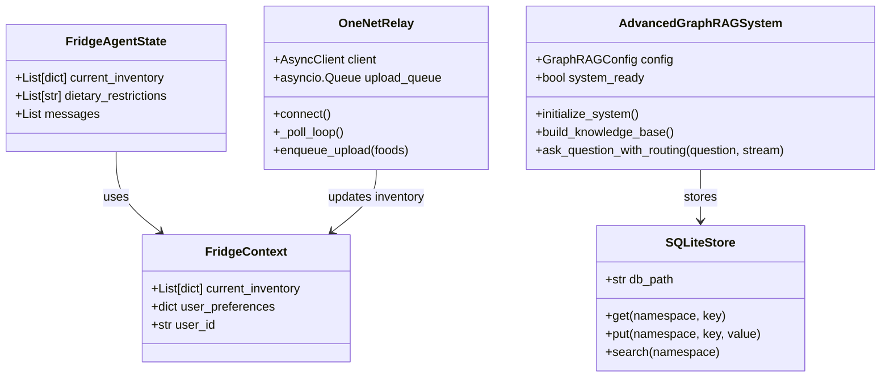
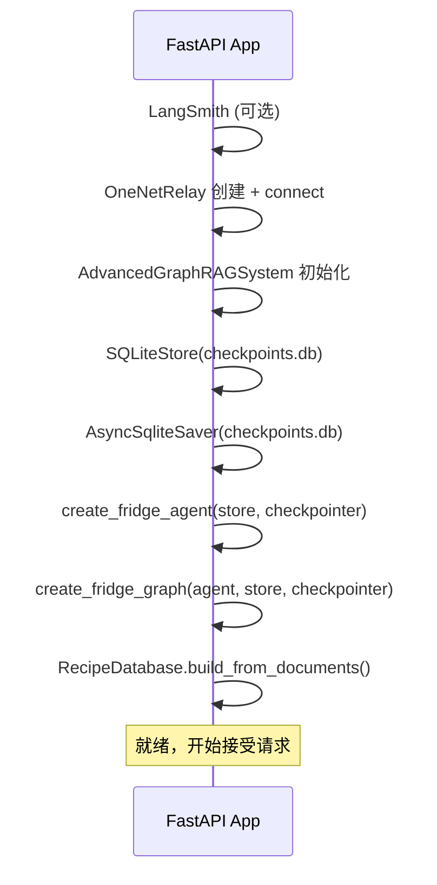

# 后端详解

> FastAPI 后端深入分析 — 生命周期、依赖注入、路由、WebSocket

## 项目文件地图

```
Backend/
├── main.py                     # RAG 系统 + Agent 工厂
├── config.py                   # GraphRAGConfig + 环境变量
├── requirements.txt            # 26 个 Python 依赖
├── .env / .env.example         # 环境变量配置
│
├── api/
│   ├── server.py               # FastAPI 入口 + lifespan + 路由注册
│   ├── models.py               # Pydantic 请求/响应模型
│   ├── auth.py                 # X-API-Key 认证中间件
│   ├── tools.py                # 8 个 @tool + FridgeContext
│   ├── dependencies.py         # 全局单例 (7 个)
│   ├── graph.py                # LangGraph StateGraph + HITL
│   ├── chat_relay.py           # /ws/chat 流式对话
│   ├── ws_relay.py             # /ws/fridge 数据推送
│   ├── onenet_relay.py         # OneNET HTTP 轮询 + 上传
│   ├── subagents.py            # 3 个子 Agent
│   ├── persistent_store.py     # SQLite 持久化 Store
│   └── routes/
│       ├── recommend.py        # POST /api/recipes/recommend
│       ├── search.py           # GET /api/recipes/search
│       ├── detail.py           # GET /api/recipes/{id}
│       ├── substitutions.py    # POST /api/recipes/{id}/suggest-substitutions
│       └── chat.py             # POST /api/chat
│
├── matching/
│   ├── recipe_database.py      # 内存菜谱库 (323 道)
│   ├── inverted_index.py       # 食材→菜谱倒排索引
│   ├── fuzzy_matcher.py        # 食材归一化 + 120+ 同义词
│   └── ingredient_extractor.py # Markdown 食材提取
│
├── rag_modules/                # 7 个 RAG 子模块
├── prompts/                    # 5 个 ChatPromptTemplate
├── scripts/fetch_images.py     # Pexels 图片采集
├── agent(代码系ai生成)/         # AI 生成的辅助工具
└── tests/                      # 测试 (unit/rag/agent/integration/e2e)
```

## 全局单例 (dependencies.py)

```python
# 7 个模块级变量，在 lifespan 中逐一初始化
recipe_db: RecipeDatabase = RecipeDatabase()
inverted_index: InvertedIndex = InvertedIndex()
rag_system = None           # AdvancedGraphRAGSystem
fridge_agent = None         # create_agent() 返回
fridge_graph = None         # CompiledStateGraph
fridge_store = None         # SQLiteStore / InMemoryStore
fridge_checkpointer = None  # AsyncSqliteSaver / InMemorySaver
current_fridge_inventory = []  # OneNET 回调更新
```

## 关键类图



## Lifespan 启动顺序

FastAPI lifespan 按依赖顺序初始化 7 个组件：

```
LangSmith 检测 → OneNet Relay → RAG 系统 → SQLiteStore → Checkpointer → Agent → Graph → RecipeDB
```



每个步骤失败时都有降级策略：
- `SQLiteStore` 失败 → 回退 `InMemoryStore`
- `AsyncSqliteSaver` 失败 → 回退 `InMemorySaver`
- `OneNetRelay` 失败 → 不影响系统启动

## OneNET Relay

### 轮询循环

```
初始化 → connect() → 启动 _poll_loop + _run_upload_worker
  │
  ├── _poll_loop: 每 0.5s 调用 OneNET API
  │   ├── 成功 → 解析管道数据 → broadcast → 重置间隔
  │   └── 失败 → 退避 (1s→2s→4s→...→30s)
  │       └── 连续 3 次失败 → 推送 12 个演示食材 (FAKE_INVENTORY_PIPE)
  │
  └── _run_upload_worker: 处理上传队列
      ├── 去重 (superseded 旧任务)
      ├── 重试 3 次 (指数退避 1s, 2s, 4s)
      └── 死信 → dead_letter/ 目录
```

### 数据格式

OneNET 存储紧凑管道格式：
```
鸡蛋|6|74|肉蛋生鲜类;西红柿|3|18|蔬菜;...
```

解析函数 `parse_compact_inventory()` 转为 Python 列表。上传函数 `_foods_to_pipe()` 反向转换。

### 上传错误分类

| 错误类型 | 行为 |
|---------|------|
| `httpx.TimeoutException` | 重试 |
| 连接/协议错误 | 重试 |
| OneNET 400/401/403/404 | 致命 → 死信 |
| 其他错误 | 致命 → 死信 |

## 持久化存储

`SQLiteStore` 与 `AsyncSqliteSaver` 共享 `checkpoints.db`：

```sql
CREATE TABLE store (
    namespace TEXT,
    key TEXT,
    value TEXT,
    PRIMARY KEY (namespace, key)
)
```

存储模式：`("preferences", user_id)` → 用户偏好 JSON，通过 `runtime.store.get/put/search` 访问。

## WebSocket 连接管理

### /ws/fridge 客户端池

```python
_clients: Set[WebSocket] = set()

async def ws_fridge(websocket):
    _clients.add(websocket)
    try:
        while True:
            msg = await websocket.receive()
            # 处理 food_upload / request_sync / ping
    finally:
        _clients.discard(websocket)

async def broadcast(data):
    for ws in list(_clients):
        try: await ws.send_json(data)
        except: _clients.discard(ws)
```

### /ws/chat 并发控制

每个 `thread_id` 同时只能有一个活跃流式任务，防止消息重叠：

```python
_chat_busy: Dict[str, bool] = {}

# 新消息到达时:
if _chat_busy.get(thread_id):
    await ws.send_json({"type": "stream_error", "error": "busy"})
    return
_chat_busy[thread_id] = True
asyncio.create_task(_handle_chat_stream(ws, msg, thread_id))
# 流完成/超时后 _chat_busy[thread_id] = False
```

## 关键配置

| 配置项 | 默认值 | 说明 |
|--------|--------|------|
| `LLM_MODEL` | `deepseek-v4-flash` | 模型名称 |
| `DEEPSEEK_BASE_URL` | `https://api.deepseek.com/v1` | API 地址 |
| `NEO4J_URI` | `bolt://localhost:7687` | Neo4j 连接 |
| `MILVUS_HOST` | `localhost` | Milvus 地址 |
| `MILVUS_PORT` | `19530` | Milvus 端口 |
| `CHUNK_SIZE` | 500 | 文档分块大小 |
| `CHUNK_OVERLAP` | 50 | 分块重叠 |
| `TOP_K` | 10 | 检索返回数 |
| `TEMPERATURE` | 0.1 | LLM 温度 |
| `MAX_TOKENS` | 2048 | 最大输出 token |
| `MAX_GRAPH_DEPTH` | 2 | 图遍历深度 |
