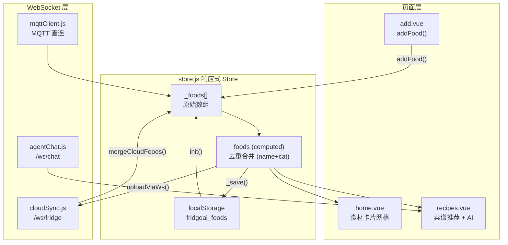

# 前端详解

> uni-app (Vue 3) 跨平台前端 — 4 页面 + 3 WebSocket + 响应式状态

## 项目结构

```
Frontend/
├── App.vue                    # 根组件 + 全局 CSS 变量
├── main.js                    # 入口 (Vue2/Vue3 双模式)
├── pages.json                 # 路由表 (4 Tab)
├── manifest.json              # 应用清单
├── vite.config.js             # Vite + OneNET 代理
│
├── pages/
│   ├── home/home.vue          # 冰箱库存管理
│   ├── recipes/recipes.vue    # 菜谱推荐 + AI 对话
│   ├── add/add.vue            # 食材录入 + 自动分类
│   └── settings/settings.vue  # 设置 + 连接配置
│
├── components/
│   ├── CustomTabBar.vue       # 自定义底部导航
│   └── recipes/
│       ├── AgentChatBox.vue   # AI 流式对话组件
│       ├── RecipeDetailModal.vue # 菜谱详情弹窗
│       └── RecipeStats.vue    # 食材统计面板
│
├── utils/
│   ├── store.js               # 响应式状态管理
│   ├── foodData.js            # 食材字典 + 分类
│   ├── cloudSync.js           # /ws/fridge 客户端
│   ├── agentChat.js           # /ws/chat 客户端
│   ├── imageResolver.js       # 图片解析
│   └── mqttClient.js          # MQTT 直连客户端
│
└── config/
    ├── app.js                 # 后端 URL 配置
    └── onenet.js              # OneNET 凭证
```

## 响应式数据流



## 4 个页面

### 冰箱页面 (home.vue)

- **食材卡片网格**：2 列布局，图片 + 名称 + 数量 + 卡路里
- **分类筛选**：横向滚动（全部/水果/蔬菜/肉蛋/饮品/包装）
- **数量调整**：+/- → `store.updateQty()` → 300ms 防抖上传
- **下拉刷新**：触发 `requestSync()` 重新拉取云端数据
- **空状态**：冰箱为空时显示引导图标

### 食谱页面 (recipes.vue)

最复杂的页面（~1350 行），三个子 Tab：

| Tab | 功能 | 数据来源 |
|-----|------|---------|
| AI 推荐 | 基于冰箱食材推荐 | `POST /api/recipes/recommend` |
| 搜索 | 按菜名/食材搜索 | `GET /api/recipes/search` |
| 全部食谱 | 标签筛选浏览 | 本地 + API |

**降级策略**：API 失败时使用内置 10 道家常菜谱后备。

### 添加页面 (add.vue)

名称输入 → `classifyFood()` 自动分类（~50 种常见食材）→ 数量+单位选择 → 提交后自动跳转

### 设置页面 (settings.vue)

OneNET 连接状态 / 后端地址配置（IP + 域名）/ 数据导出 / 版本信息

---

## 3 个 WebSocket 连接

### /ws/fridge — cloudSync.js

双向食材同步。合并策略：同一 `name|cat` 取较大数量。断开 2 秒自动重连。

### /ws/chat — agentChat.js

AI 流式对话。自定义事件系统：`token → toolStart → toolEnd → done/error`。断开 3 秒自动重连。

### MQTT — mqttClient.js

纯 JS 实现的 MQTT 3.1.1 协议客户端：完整协议编码 + HMAC-MD5 认证 + 指数退避重连（500ms→60s）。

---

## AgentChatBox 组件

最复杂的 UI 组件：

- **流式打字机效果**：逐 token 渲染
- **富文本解析**：Markdown 表格、列表、标题、粗体、代码
- **工具状态卡片**：调用工具时显示进度
- **HITL 审批卡片**：确认/拒绝按钮
- **快捷问题**：3 个预设问题
- **消息折叠**：>500 字自动折叠
- **Thread ID 持久化**：跨会话连续对话

## 图片解析 (imageResolver.js)

5 级回退：本地 mapping → 去前缀 → 英文名 → 子串 → Unsplash URL

## 设计系统

深色科技风 CSS：
```css
--bg-deep: #06090f;    --bg-panel: #0d1117;
--bg-card: rgba(22,27,40,0.72);  --accent-cyan: #00d4ff;
```

移动端：>701px 时居中显示 430px 宽手机形态。
