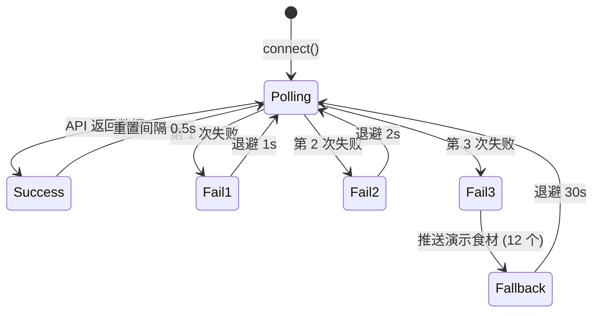
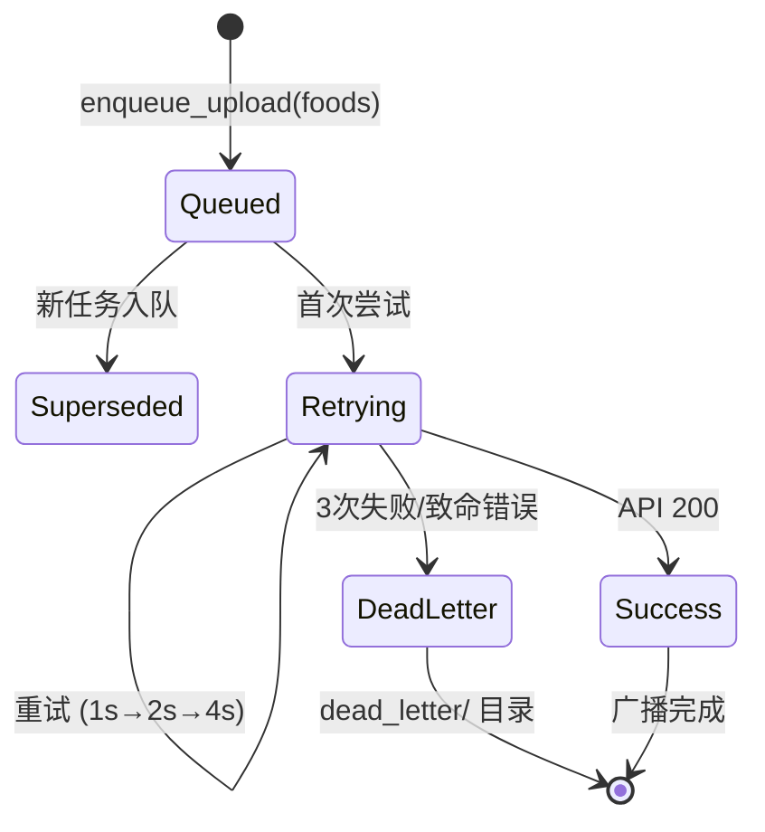
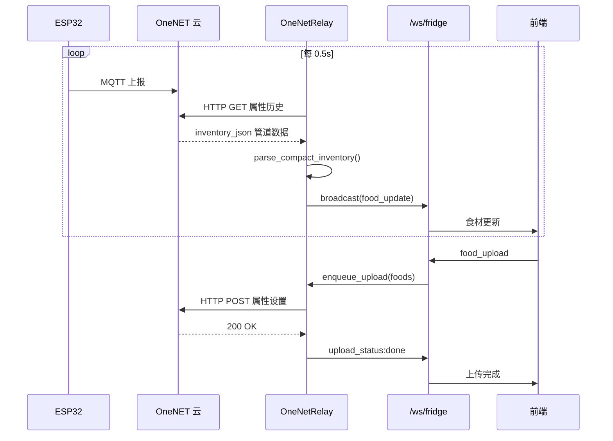

# 物联网集成

> OneNET + MQTT + ESP32 物联网数据管道

## 架构概览

```mermaid
flowchart LR
    subgraph 硬件["硬件层"]
        ESP["ESP32 传感器<br/>温度/湿度/门磁/重量"]
        RK["RK3588 边缘计算<br/>本地推理 + 数据预处理"]
    end

    subgraph 云["OneNET 云平台"]
        STUDIO["OneNET Studio<br/>设备管理 + 属性存储"]
        MQTT_B["MQTT Broker<br/>消息路由"]
    end

    subgraph 后端["FridgeAI 后端"]
        RELAY["OneNetRelay<br/>HTTP 轮询 + 上传队列"]
        PARSE["数据解析<br/>管道 ↔ JSON"]
        WS["/ws/fridge<br/>WebSocket 广播"]
        INV["current_inventory<br/>冰箱食材快照"]
    end

    subgraph 前端["用户端"]
        UI["uni-app 前端"]
        MQTT_C["mqttClient.js<br/>MQTT 直连 (备选)"]
    end

    ESP -->|"MQTT"| MQTT_B --> STUDIO
    RK -->|"HTTP"| STUDIO
    STUDIO -->|"HTTP API<br/>0.5s 轮询"| RELAY
    RELAY --> PARSE --> INV
    INV --> WS --> UI
    MQTT_C -->|"MQTT over WS"| MQTT_B

    style RELAY fill:#0d1117,stroke:#00d4ff
    style INV fill:#0d1117,stroke:#a371f7
```



## OneNetRelay 详解

`api/onenet_relay.py` 是物联网数据中枢。

### 轮询循环状态机



### 数据格式

OneNET 存储紧凑管道格式，解析示例：
```
鸡蛋|6|74|肉蛋生鲜类;西红柿|3|18|蔬菜;牛奶|1|120|饮品
  ↓ parse_compact_inventory()
[
  {"name":"鸡蛋","qty":6,"cal":74,"cat":"肉蛋生鲜类","fromCloud":true},
  {"name":"西红柿","qty":3,"cal":18,"cat":"蔬菜","fromCloud":true},
  {"name":"牛奶","qty":1,"cal":120,"cat":"饮品","fromCloud":true}
]
```

### 上传队列状态机



### 错误分类

| 错误 | 分类 | 行为 |
|------|------|------|
| `httpx.TimeoutException` | 可重试 | 退避后重试 |
| 连接重置 / 协议错误 | 可重试 | 退避后重试 |
| OneNET 400/401/403/404 | 致命 | 写入死信 |

### 认证

OneNET API 使用 HMAC-SHA1 签名令牌。

---

## 前端 MQTT 客户端

`mqttClient.js` — 纯 JS 实现的 MQTT 3.1.1 协议客户端：

| 报文 | 方法 | 说明 |
|------|------|------|
| CONNECT | `buildConnectPacket()` | 连接 + 认证 |
| SUBSCRIBE | `buildSubscribePacket()` | 订阅主题 |
| PUBLISH | `buildPublishPacket()` / `decodePublishPacket()` | 收发消息 |
| PINGREQ | `buildPingReqPacket()` | 心跳 (55s) |

### 订阅主题

- `$sys/{pid}/{device}/dp/post/json/+` — 设备数据点
- `$sys/{pid}/{device}/thing/property/post/reply` — 属性回复

### 认证算法

HMAC-MD5 签名：`sign = hmac_md5(deviceSecret, payload)`，纯 JS 实现 MD5 算法。

### 重连策略

指数退避：500ms → 1s → 2s → 4s → 8s → 16s → 30s → 60s (max)

---

## 数据流时序



## 演示模式

OneNET 不可用时（未配置或连续 3 次失败），自动推送 12 个演示食材：

```
鸡蛋、西红柿、土豆、青椒、牛肉、豆腐、
白菜、胡萝卜、鸡胸肉、洋葱、大蒜、牛奶
```

确保无硬件环境也能体验完整功能。
