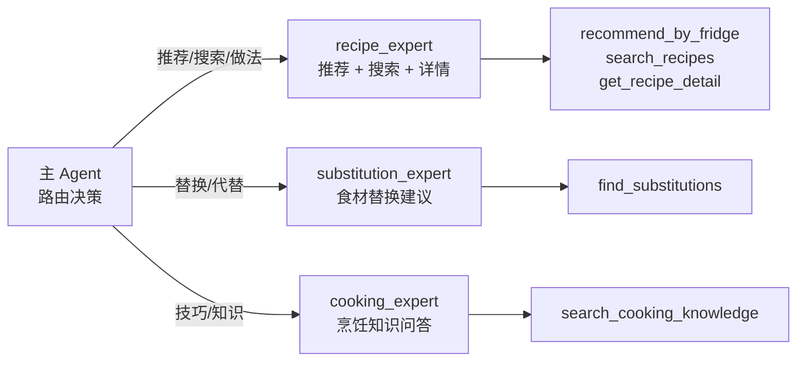
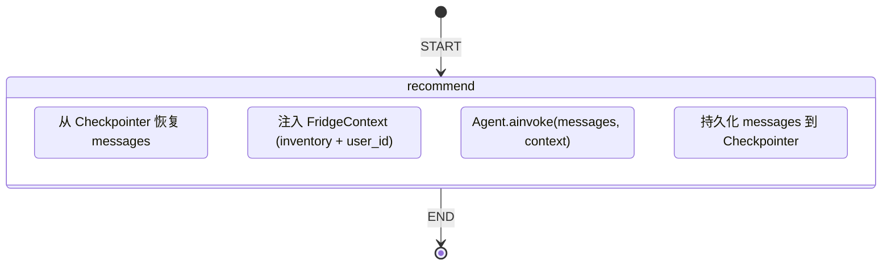
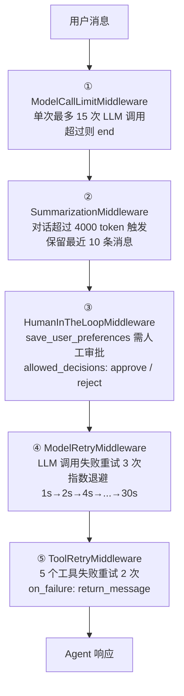
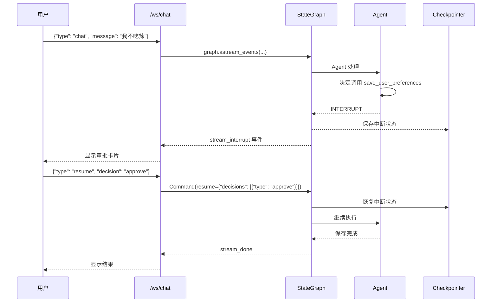

# Agent 系统

> LangChain + LangGraph 多 Agent 协作系统 — 8 Tool + 3 Sub-agent + HITL

## Agent 架构总览

```mermaid
graph TB
    subgraph 入口["用户入口"]
        WS["/ws/chat<br/>WebSocket 流式"]
        REST["/api/chat<br/>REST 非流式"]
    end

    subgraph Graph["LangGraph StateGraph"]
        CHECK["Checkpointer<br/>AsyncSqliteSaver"]
        STORE_M["Store<br/>SQLiteStore"]
        STATE["FridgeAgentState<br/>messages + inventory + dietary"]
    end

    subgraph MainAgent["主 Agent (create_agent)"]
        SYS["System Prompt<br/>路由规则 + 输出格式"]
        MW1["ModelCallLimit<br/>最多 15 次调用"]
        MW2["Summarization<br/>4000 token 触发"]
        MW3["HITL<br/>save_preferences 中断"]
        MW4["ModelRetry<br/>3 次重试"]
        MW5["ToolRetry<br/>2 次重试"]
    end

    subgraph DirectTools["直属工具 (3 个)"]
        T1["get_fridge_inventory<br/>查看冰箱食材"]
        T2["save_user_preferences<br/>保存偏好"]
        T3["get_user_preferences<br/>读取偏好"]
    end

    subgraph SubAgents["子 Agent (3 个)"]
        SA1["recipe_expert<br/>菜谱推荐专家"]
        SA2["substitution_expert<br/>食材替换专家"]
        SA3["cooking_expert<br/>烹饪知识专家"]
    end

    subgraph SubTools["子 Agent 底层工具"]
        ST1["recommend_by_fridge"]
        ST2["search_recipes_by_ingredients"]
        ST3["get_recipe_detail"]
        ST4["find_substitutions"]
        ST5["search_cooking_knowledge"]
    end

    WS --> Graph
    REST --> Graph
    Graph --> MainAgent
    MainAgent --> DirectTools
    MainAgent --> SubAgents
    SA1 --> ST1 & ST2 & ST3
    SA2 --> ST4
    SA3 --> ST5

    MainAgent --> MW1 --> MW2 --> MW3 --> MW4 --> MW5
    Graph --> CHECK
    Graph --> STORE_M

    style MainAgent fill:#0d1117,stroke:#a371f7
    style Graph fill:#0d1117,stroke:#00d4ff
    style SubAgents fill:#0d1117,stroke:#3fb950
```



## 三种 Agent 模式

| 模式 | 工具数量 | 特点 | 适用场景 |
|------|---------|------|---------|
| `basic` (V1) | 4 个基础 tool | 无上下文感知, LLM 需手动传参 | 兼容旧版 |
| `context` (V2) | 8 个 tool | ToolRuntime 自动注入冰箱食材 | 单 Agent 场景 |
| `subagents` (V3) | 6 个 (3直属+3子Agent) | 多 Agent 协作,专家分工 | **当前默认** |

## 8 个 Tool 详解

每个 tool 都是标准的 LangChain `@tool` 装饰器函数，定义在 `api/tools.py` 中。

### 1. get_fridge_inventory

```
@tool
def get_fridge_inventory(runtime: ToolRuntime[FridgeContext]) -> str
```

从 `runtime.context.current_inventory` 读取冰箱食材快照，返回 JSON 格式清单。

- **无需参数**：上下文自动注入
- **冰箱空时**：返回 `{"status": "empty", "message": "..."}`
- **适用场景**：用户问「冰箱里有什么」

### 2. recommend_by_fridge

```
@tool
def recommend_by_fridge(runtime: ToolRuntime[FridgeContext], limit: int = 5) -> str
```

核心上下文感知推荐工具。自动读取冰箱库存 → 归一化 → `fuzzy_lookup` → 按忌口过滤 → 按匹配数排序。

- **自动读取**：无需 LLM 传食材列表
- **忌口过滤**：从 `runtime.context.user_preferences` 读取忌口
- **返回格式**：JSON, 包含匹配/缺失食材、匹配度

### 3. search_recipes_by_ingredients

```
@tool
def search_recipes_by_ingredients(ingredients: List[str], limit: int = 5) -> str
```

根据指定食材列表搜索菜谱。通过 `FuzzyMatcher.normalize_fridge_items` + `inverted_index.fuzzy_lookup` 匹配。

- **参数**：食材名称列表（LLM 传入）
- **匹配逻辑**：精确 → 同义词 → 子串
- **排序**：按匹配食材数降序

### 4. get_recipe_detail

```
@tool
def get_recipe_detail(recipe_id: str) -> str
```

从 `RecipeDatabase` 获取菜谱完整详情：名称、分类、难度、时间、食材、步骤、小贴士、标签。

### 5. find_substitutions

```
@tool
def find_substitutions(ingredient_name: str) -> str
```

调用独立 LLM 实例（`fridge_model`），为缺少的食材生成 2-3 个替代方案。

- **独立模型**：`ChatOpenAI` + DeepSeek，temperature=0.0（确保一致性）
- **回退方案**：LLM 不可用时返回「建议去超市购买」

### 6. search_cooking_knowledge

```
@tool
def search_cooking_knowledge(question: str) -> str
```

调用 `rag_system.ask_question_with_routing()` 完整 RAG 管线：
查询分析 → 路由选择 → 混合/图检索 → LLM 生成答案。

### 7. save_user_preferences

```
@tool
def save_user_preferences(preferences: dict, runtime: ToolRuntime[FridgeContext]) -> str
```

将偏好合并后通过 `runtime.store.put()` 持久化到 `("preferences", user_id)` 命名空间。

- **HITL 中断**：此工具触发 `HumanInTheLoopMiddleware`，需用户审批
- **合并策略**：新偏好与已有偏好合并，不覆盖

### 8. get_user_preferences

```
@tool
def get_user_preferences(runtime: ToolRuntime[FridgeContext]) -> str
```

从 `runtime.store.get()` 读取持久化偏好，回退到 `runtime.context.user_preferences`。

---

## FridgeContext 上下文注入

```python
@dataclass
class FridgeContext:
    current_inventory: List[dict]   # 冰箱食材快照
    user_preferences: dict          # 用户偏好 (fallback)
    user_id: str = "default"       # 用户标识 (Store 隔离)
```

每次 Agent 调用时通过 `agent.invoke(..., context=FridgeContext(...))` 注入。
工具函数内通过 `runtime: ToolRuntime[FridgeContext]` 访问，无需 LLM 手动传递。

---

## 3 个子 Agent

定义在 `api/subagents.py`，每个子 Agent 是独立的 `create_agent()` 实例，包装为 `@tool` 供主 Agent 调用。



### recipe_expert（菜谱推荐专家）

- **内部工具**：`recommend_by_fridge`, `search_recipes_by_ingredients`, `get_recipe_detail`
- **系统提示**：Markdown 表格格式，最多 5 个推荐，优先匹配度高的
- **注意**：不使用 `response_format`（DeepSeek 上不可靠）

### substitution_expert（食材替换专家）

- **内部工具**：`find_substitutions`
- **temperature**: 0.0（确保替换建议一致性）
- **系统提示**：2-3 个替代方案，标注口味影响，优先推荐冰箱已有的

### cooking_expert（烹饪知识专家）

- **内部工具**：`search_cooking_knowledge`
- **系统提示**：引用检索结果，输出最多 300 字，使用 `###` 标题

### 共享模型工厂

```python
def _make_model(temperature=0.1, disable_thinking=False):
    return init_chat_model(
        model=f"openai:{model_name}",
        openai_api_key=os.getenv("DEEPSEEK_API_KEY"),
        openai_api_base="https://api.deepseek.com/v1",
        http_client=httpx.Client(timeout=httpx.Timeout(connect=10, read=30, write=10, pool=10)),
    )
```

使用缓存 `_model_cache` 避免重复创建。`disable_thinking=True` 用于需要 `response_format` 的场景。

---

## LangGraph StateGraph

`api/graph.py` 将 Agent 嵌入 LangGraph，实现多轮对话持久化：



### FridgeAgentState

```python
class FridgeAgentState(AgentState):
    current_inventory: List[dict]    # 冰箱食材快照
    dietary_restrictions: List[str]  # 饮食限制
```

### 使用方式

```python
graph = get_fridge_graph()
config = {"configurable": {"thread_id": "user_abc"}}

# 第一轮
graph.invoke({"messages": [{"role": "user", "content": "能做什么菜?"}]}, config=config)

# 第二轮（自动继承上文）
graph.invoke({"messages": [{"role": "user", "content": "第一个菜怎么做?"}]}, config=config)
```

---

## 5 层中间件

Agent 的每次调用经过 5 层中间件管道：



### 各中间件参数

| 中间件 | 关键参数 | 说明 |
|--------|---------|------|
| `ModelCallLimitMiddleware` | `run_limit=15` | 防止 Agent 陷入循环 |
| `SummarizationMiddleware` | `trigger=4000 tokens`, `keep=10 msgs` | 中文摘要提示，聚焦偏好+菜谱+需求 |
| `HumanInTheLoopMiddleware` | `interrupt_on={"save_user_preferences"}` | 用户审批后才能保存 |
| `ModelRetryMiddleware` | `max_retries=3`, `backoff_factor=2.0` | 处理 DeepSeek API 临时故障 |
| `ToolRetryMiddleware` | `max_retries=2`, 5 个指定工具 | 失败时返回错误消息而非抛异常 |

---

## HITL 人类介入循环



恢复代码：
```python
from langgraph.types import Command
graph.invoke(
    Command(resume={"decisions": [{"type": "approve"}]}),
    config=config
)
```

---

## 流式对话协议

`/ws/chat` 使用 `astream_events(v2)` + `anext()` 实现 token 级流式输出。

### 事件类型

| 事件 | 方向 | 说明 |
|------|------|------|
| `stream_token` | 服务端→客户端 | 单个文本 token |
| `stream_tool_start` | 服务端→客户端 | 工具调用开始 |
| `stream_tool_end` | 服务端→客户端 | 工具调用完成 |
| `stream_tool_error` | 服务端→客户端 | 工具调用出错 |
| `stream_interrupt` | 服务端→客户端 | HITL 中断，等待审批 |
| `stream_done` | 服务端→客户端 | 对话完成 |
| `stream_error` | 服务端→客户端 | 对话出错 |

### 客户端消息

| 消息类型 | 方向 | 说明 |
|---------|------|------|
| `chat` | 客户端→服务端 | 发送对话消息 |
| `ping` | 客户端→服务端 | 心跳保活 |
| `resume` | 客户端→服务端 | HITL 审批决定 |

### 超时与容错

- 每个事件超时：30 秒
- 总对话超时：60 秒
- 使用 `asyncio.wait_for` + `anext()` 逐事件超时控制

---

## Long-term Memory（长期记忆）

通过 `runtime.store` 实现跨会话持久化：

```
namespace: ("preferences",)
key: user_id (从 thread_id 获取)
value: {"忌口": ["花生"], "偏好菜系": "川菜", "人数": 2}
```

存储实现：`SQLiteStore`（生产）或 `InMemoryStore`（开发回退），数据持久化到 `checkpoints.db`。
