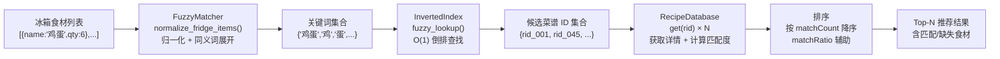
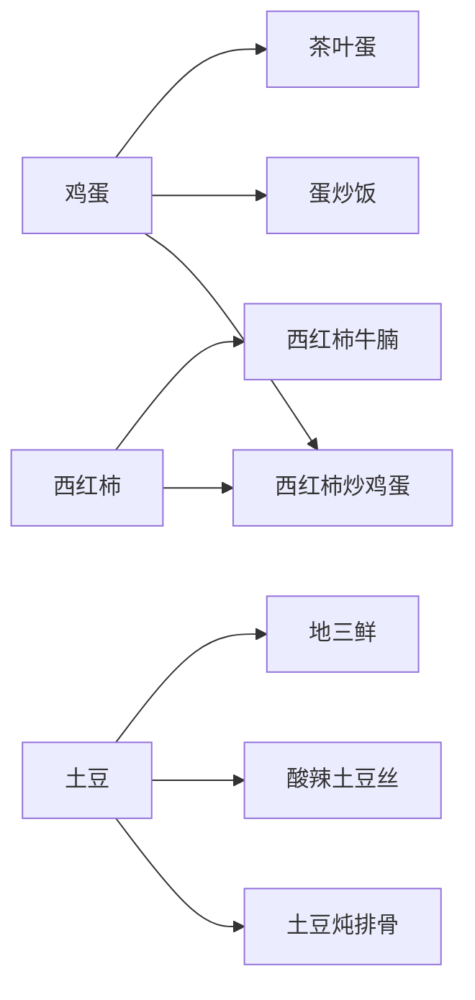
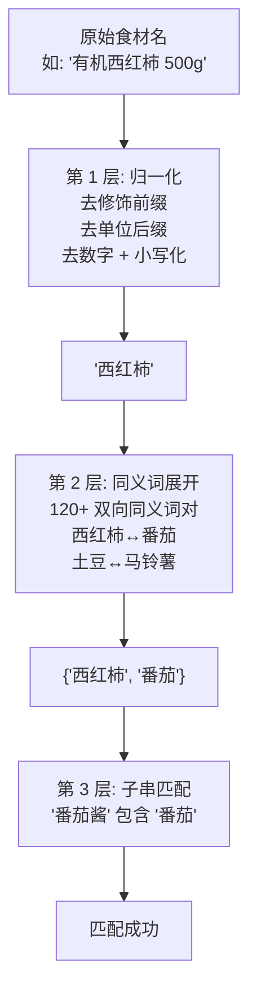

# 菜谱匹配引擎

> 食材→菜谱毫秒级匹配 — RecipeDatabase + InvertedIndex + FuzzyMatcher

## 匹配管线总览



---

## 1. RecipeDatabase — 菜谱数据库

内存常驻的 `Dict[str, Dict]` 结构，以菜谱 ID 为键。

```python
class RecipeDatabase:
    _recipes: Dict[str, Dict] = {}

    def build_from_documents(docs):
        for doc in docs:
            recipe = IngredientExtractor.extract(doc)
            self._recipes[recipe["id"]] = recipe

    def get(recipe_id: str) -> Optional[Dict]: ...
    def search_names(query: str) -> List[Dict]: ...
```

### 搜索算法

字符索引 → 完全匹配 > 前缀匹配 > 包含匹配

### 菜谱字段

| 字段 | 类型 | 说明 |
|------|------|------|
| `id` | str | 唯一标识 |
| `name` | str | 菜谱名称 |
| `category` | str | 分类 |
| `difficulty` | str | 难度 |
| `time` | str | 预估时间 |
| `ingredients` | list | 食材列表 |
| `steps` | list | 烹饪步骤 |
| `tips` | str | 小贴士 |
| `tags` | list | 标签 |

---

## 2. InvertedIndex — 倒排索引

```
食材名 → Set[菜谱ID]

  "鸡蛋" → {"recipe_001", "recipe_012", "recipe_045"}
  "西红柿" → {"recipe_001", "recipe_045"}
  "土豆" → {"recipe_023", "recipe_067"}
```



### 查询方法

```python
def lookup(ingredient_name: str) -> Set[str]:
    """O(1) 精确查询"""
    return self._index.get(ingredient_name, set())

def fuzzy_lookup(fridge_names: List[str]) -> Set[str]:
    """O(n) 模糊查询: 精确匹配 + 子串回退"""
    result = set()
    for name in fridge_names:
        if name in self._index:
            result.update(self._index[name])
        else:
            for key in self._index:
                if name in key or key in name:
                    result.update(self._index[key])
    return result
```

---

## 3. FuzzyMatcher — 模糊匹配器

三层匹配策略：



### 归一化规则

| 步骤 | 示例 |
|------|------|
| 去修饰前缀 | `有机西红柿` → `西红柿` |
| 去单位后缀 | `鸡蛋500g` → `鸡蛋` |
| 去数字 | `西红柿3个` → `西红柿` |
| 小写化 | `Beef` → `beef` |

### 同义词示例（120+ 对）

```
番茄 ↔ 西红柿          土豆 ↔ 马铃薯 ↔ 洋芋
酱油 ↔ 生抽 ↔ 老抽      鸡蛋 ↔ 鸡子
面粉 ↔ 中筋面粉          大蒜 ↔ 蒜头 ↔ 蒜
辣椒 ↔ 红辣椒 ↔ 干辣椒   豆腐 ↔ 嫩豆腐 ↔ 老豆腐
```

### 核心函数

```python
@staticmethod
def normalize(name: str) -> str:
    """去除修饰前缀、单位后缀、数字，小写化"""

@staticmethod
def is_match(ingredient: str, fridge_names: Set[str]) -> bool:
    """检查食材是否匹配冰箱中任何食材"""

@staticmethod
def normalize_fridge_items(items: List[dict]) -> List[str]:
    """归一化所有冰箱物品，展开同义词"""
```

---

## 4. IngredientExtractor — 食材提取器

从 HowToCook Markdown 中提取结构化食材：

```markdown
# 西红柿炒鸡蛋
- 鸡蛋 3个
- 西红柿 2个
- 葱 1根
- 盐 适量

### 第1步
打散鸡蛋...
### 第2步
西红柿切块...
```

提取逻辑：
1. 解析 `- item` 行 → 食材列表
2. 解析 `### 第N步` → 步骤列表
3. 根据星级难度估算时间 (1星=10分钟, 5星=90分钟)
4. 过滤工具关键词（锅、铲、碗...）

---

## 性能特征

| 操作 | 复杂度 | 实际耗时 |
|------|--------|---------|
| 倒排索引查询 | O(1) | < 0.1ms |
| 模糊匹配 (归一化) | O(n) | < 0.01ms |
| 全量推荐 (323 道菜谱) | O(m×n) | < 1ms |
| 名称搜索 | O(k) | < 0.5ms |

---

## 调用关系

```mermaid
graph TB
    AGENT["Agent<br/>recommend_by_fridge"]
    ROUTE["API<br/>/api/recipes/recommend"]
    FE["前端<br/>recipes.vue"]

    AGENT --> MATCHER["FuzzyMatcher<br/>normalize_fridge_items()"]
    ROUTE --> MATCHER
    FE --> MATCHER

    MATCHER --> IDX["InvertedIndex<br/>fuzzy_lookup()"]
    IDX --> DB["RecipeDatabase<br/>get(rid)"]
    DB --> RANK["计算匹配度<br/>matchCount / matchRatio"]
    RANK --> RESULT["排序输出"]

    style MATCHER fill:#0d1117,stroke:#00d4ff
    style IDX fill:#0d1117,stroke:#a371f7
    style DB fill:#0d1117,stroke:#3fb950
```



三条调用路径（Agent / API / 前端）共享同一套匹配引擎，确保推荐结果一致。
