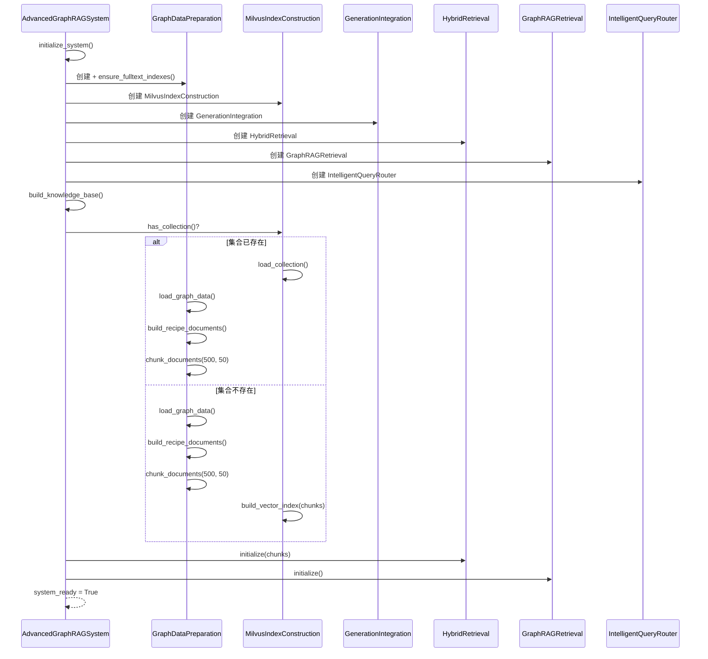
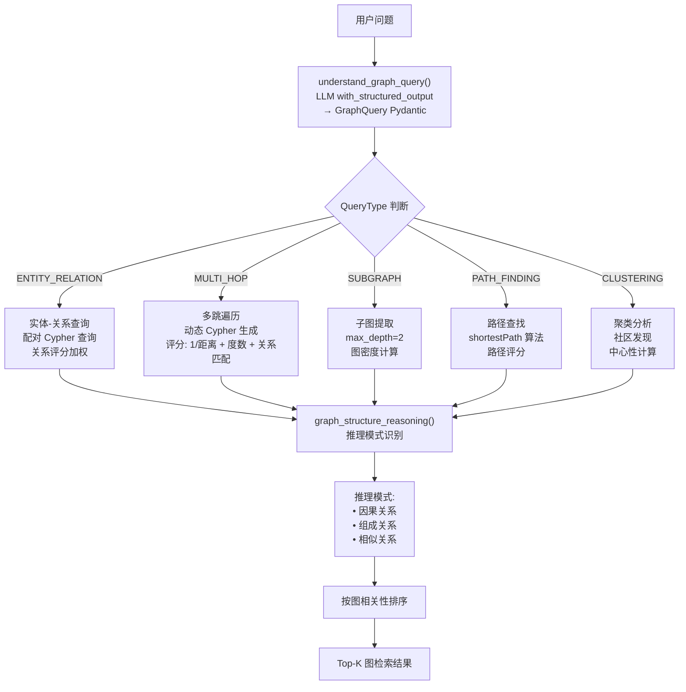
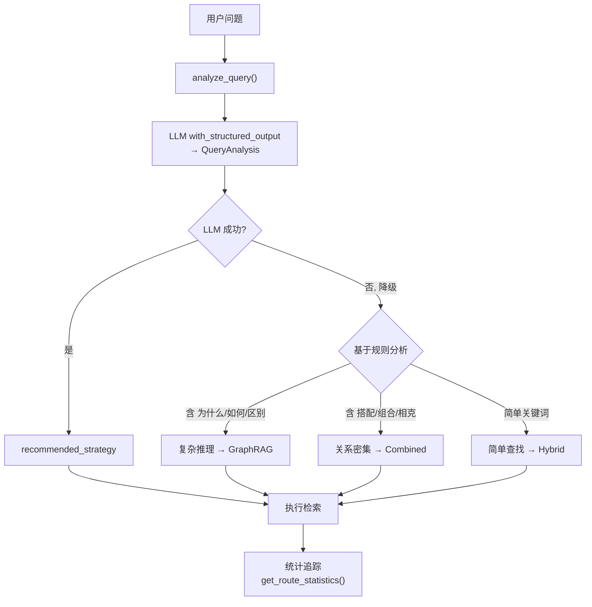
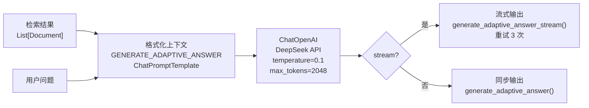

# RAG 检索系统

> 基于 Neo4j 图数据库 + Milvus 向量数据库的 GraphRAG 检索增强生成系统

## RAG 管线总览

```mermaid
flowchart TD
    Q["用户问题"] --> ANALYZE["查询分析<br/>QueryAnalysis Pydantic"]
    ANALYZE --> ROUTE{"智能路由<br/>3 种策略选择"}

    ROUTE -->|"简单查找"| HYBRID["混合检索 HybridTraditional"]
    ROUTE -->|"复杂推理"| GRAPH["图 RAG 检索 GraphRAG"]
    ROUTE -->|"综合查询"| COMBINED["组合检索 Combined"]

    subgraph Hybrid["混合检索管线"]
        BM25["BM25 关键词"]
        VEC["Milvus 向量<br/>BGE-small-zh 512d"]
        GIDX["图索引<br/>实体 K-V + 关系 K-V"]
        FUSE["加权融合<br/>向量 0.5 + BM25 0.3 + 图索引 0.2"]
        BM25 --> FUSE
        VEC --> FUSE
        GIDX --> FUSE
    end

    subgraph Graph["图 RAG 检索管线"]
        UNDERSTAND["理解图查询<br/>GraphQuery 结构化"]
        MULTI["多跳遍历<br/>Cypher 动态生成"]
        SUBGRAPH["子图提取<br/>max_depth=2"]
        REASON["图结构推理<br/>因果/组成/相似"]
        UNDERSTAND --> MULTI
        UNDERSTAND --> SUBGRAPH
        MULTI --> REASON
        SUBGRAPH --> REASON
    end

    HYBRID --> FUSE
    GRAPH --> REASON
    COMBINED --> FUSE
    COMBINED --> REASON

    FUSE --> GEN["LLM 答案生成<br/>DeepSeek ChatOpenAI"]
    REASON --> GEN
    GEN --> ANSWER["最终答案"]

    style ROUTE fill:#0d1117,stroke:#a371f7
    style FUSE fill:#0d1117,stroke:#00d4ff
    style REASON fill:#0d1117,stroke:#3fb950
```



## 系统初始化

`AdvancedGraphRAGSystem` (定义在 `main.py`) 是 RAG 系统的顶层编排类。

### 启动流程



### 知识库统计

| 指标 | 典型值 |
|------|--------|
| 菜谱数量 | 323 |
| 食材种类 | 500+ |
| 烹饪步骤 | 3000+ |
| 文档块数 | ~800 |
| 向量维度 | 512 (BGE-small-zh) |

---

## 1. 图数据准备 (GraphDataPreparation)

负责 Neo4j 图数据库的连接、数据加载和文档构建。

### 图模型

```mermaid
graph TB
    RECIPE["Recipe<br/>菜谱节点<br/>nodeId: 200000000+"]
    INGR["Ingredient<br/>食材节点"]
    STEP["CookingStep<br/>步骤节点"]
    CAT["Category<br/>分类节点"]

    RECIPE -->|"REQUIRES<br/>需要食材"| INGR
    RECIPE -->|"CONTAINS_STEP<br/>包含步骤"| STEP
    RECIPE -->|"BELONGS_TO_CATEGORY<br/>属于分类"| CAT

    style RECIPE fill:#0d1117,stroke:#a371f7
    style INGR fill:#0d1117,stroke:#3fb950
    style STEP fill:#0d1117,stroke:#00d4ff
```



### 核心方法

| 方法 | 说明 |
|------|------|
| `load_graph_data()` | 从 Neo4j 查询所有菜谱/食材/步骤节点 |
| `build_recipe_documents()` | 图遍历构建文档：Recipe → REQUIRES → Ingredient, Recipe → CONTAINS_STEP → Step |
| `chunk_documents(size=500, overlap=50)` | 基于标题分割，保持语义完整 |
| `build_cooking_knowledge_documents()` | 从 JSON 加载烹饪知识文档 |
| `ensure_fulltext_indexes()` | 创建 Recipe 和 Ingredient 的 Neo4j 全文索引 |

---

## 2. Milvus 向量索引 (MilvusIndexConstruction)

负责向量化存储和语义检索。

### 关键参数

| 参数 | 值 | 说明 |
|------|-----|------|
| 嵌入模型 | `BAAI/bge-small-zh-v1.5` | 中文优化, 512 维, < 100MB |
| 索引类型 | HNSW | 图-based 近似最近邻 |
| M | 16 | HNSW 每层连接数 |
| efConstruction | 200 | 构建时搜索宽度 |
| ef (搜索) | 64 | 查询时搜索宽度 |
| 距离度量 | Cosine | 余弦相似度 |
| 批量大小 | 100 | 每批插入向量数 |

### 集合 Schema

| 字段 | 类型 | 说明 |
|------|------|------|
| `id` | VARCHAR (PK) | 文档块唯一 ID |
| `vector` | FLOAT_VECTOR(512) | BGE 嵌入向量 |
| `text` | VARCHAR(15000) | 原始文本 |
| `recipe_name` | VARCHAR | 菜谱名称 |
| `category` | VARCHAR | 分类 |
| `difficulty` | VARCHAR | 难度 |
| `doc_type` | VARCHAR | 文档类型 (recipe/cooking_knowledge) |

### 双模式支持

- **Standalone 模式**: 连接独立 Milvus 服务 (`http://host:19530`)，适合生产
- **Lite 模式**: 嵌入式 `milvus_lite.db` 本地文件，适合开发

---

## 3. 混合检索 (HybridRetrieval)

三路融合检索引擎：

```mermaid
flowchart LR
    QUERY["查询"] --> DUAL["双层关键词提取<br/>实体级 + 主题级"]

    DUAL --> ENTITY["实体级检索<br/>图索引 K-V 匹配<br/>一跳邻居扩展<br/>全文索引回退"]
    DUAL --> TOPIC["主题级检索<br/>关系 K-V 匹配<br/>分类匹配<br/>标签 CONTAINS 回退"]

    ENTITY --> SCORE1["分数 × 0.2"]
    TOPIC --> SCORE1

    QUERY --> VECTOR["向量检索<br/>Milvus similarity_search<br/>k=10, ef=64"]
    VECTOR --> SCORE2["分数 × 0.5"]

    QUERY --> BM25["BM25 关键词检索"]
    BM25 --> SCORE3["分数 × 0.3"]

    SCORE1 --> FUSE["加权融合<br/>Round-robin 合并"]
    SCORE2 --> FUSE
    SCORE3 --> FUSE

    FUSE --> BOOST{"cooking_knowledge<br/>图分数 < 0.8?"}
    BOOST -->|"是, ×1.4"| RESULT["Top-K 结果"]
    BOOST -->|"否"| RESULT

    style FUSE fill:#0d1117,stroke:#a371f7
```



### 检索权重

| 检索引擎 | 权重 | 说明 |
|---------|------|------|
| 图索引 (实体+关系 K-V) | 0.2 | 精确匹配 + 结构信息 |
| 向量检索 (Milvus) | 0.5 | 语义相似度，主力引擎 |
| BM25 关键词 | 0.3 | 关键词命中，召回保证 |

### 特殊处理

- **烹饪知识 boost**: 当图索引最高分 < 0.8 时，`cooking_knowledge` 文档分数 ×1.4，补偿实体级检索对自由文本的偏差
- **关键词提取回退**: LLM `with_structured_output` 失败时，回退到基于正则的中文二元组提取

---

## 4. 图 RAG 检索 (GraphRAGRetrieval)

基于 Neo4j 图结构的深度推理检索，支持 5 种查询类型：



### GraphQuery 结构化输出

```python
class GraphQuery(BaseModel):
    query_type: QueryType          # 5 种查询类型
    source_entities: List[str]     # 源实体
    target_entities: List[str]     # 目标实体
    relation_types: List[str]      # 关系类型
    max_depth: int = 2             # 最大遍历深度
    max_nodes: int = 50            # 最大节点数
    constraints: List[str]         # 约束条件
```

---

## 5. 智能查询路由 (IntelligentQueryRouter)

自动分析查询特征，选择最优检索策略。



### QueryAnalysis 模型

```python
class QueryAnalysis(BaseModel):
    query_complexity: float         # 0-1 复杂度评分
    relationship_intensity: float   # 0-1 关系密集度
    reasoning_required: bool        # 是否需要逻辑推理
    entity_count: int               # 涉及实体数量
    recommended_strategy: SearchStrategy  # hybrid_traditional / graph_rag / combined
    confidence: float               # 置信度 0-1
    reasoning: str                  # 路由理由
```

### 三种策略

| 策略 | 触发条件 | 检索方式 |
|------|---------|---------|
| `hybrid_traditional` | 简单查找、关键词匹配 | BM25 + Milvus 向量 + 图索引 |
| `graph_rag` | 需要推理、关系复杂 | Neo4j 多跳/子图/路径 |
| `combined` | 综合查询 | 两者融合，图 RAG 优先，Round-robin 合并 |

---

## 6. 答案生成 (GenerationIntegration)



### DeepSeek 适配

```python
ChatOpenAI(
    api_key=os.getenv("DEEPSEEK_API_KEY"),
    base_url="https://api.deepseek.com/v1",
    model_kwargs={"extra_body": {"thinking": {"type": "disabled"}}},  # 禁用思考模式
)
```

- **禁用 thinking**：避免与 `tool_choice` / `response_format` 冲突
- **超时配置**：`stream_chunk_timeout=120`，防止 TCP 静默断开导致永久挂起
- **重试机制**：流式失败自动回退到非流式

---

## 7. 查询路由统计

系统追踪每次查询的路由决策，提供运行时统计：

| 策略 | 占比 | 说明 |
|------|------|------|
| `hybrid_traditional` | ~60% | 大部分用户查菜谱、搜食材 |
| `graph_rag` | ~20% | 复杂推理如「为什么牛肉和土豆搭配好」 |
| `combined` | ~20% | 综合查询需要多维度信息 |

## 降级策略

| 故障场景 | 降级方案 |
|---------|---------|
| LLM 查询分析失败 | 基于规则的复杂度判断 |
| Neo4j 不可用 | 仅 Milvus + BM25 |
| Milvus 不可用 | 仅 Neo4j + BM25（通过 `rag_system=None` 模式） |
| DeepSeek API 超时 | 重试 3 次 → 返回错误消息 |
| Embedding 模型未下载 | 自动从 HuggingFace 下载 |
