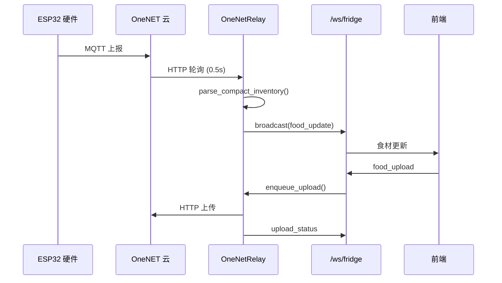
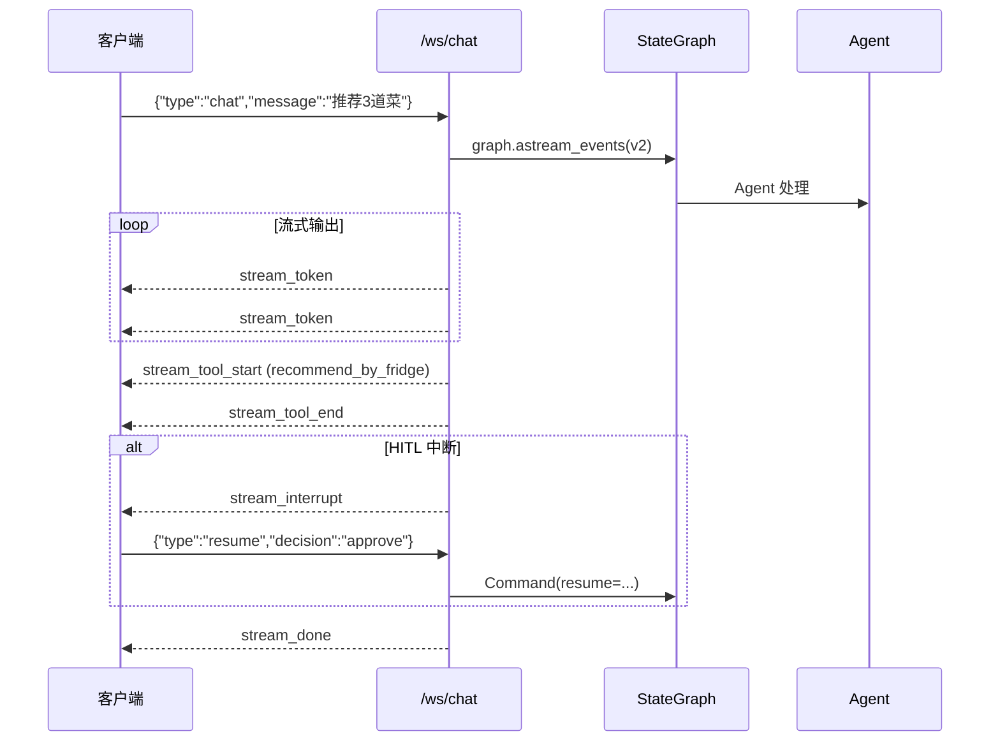

# API 接口文档

> FridgeAI 完整 API 参考 — 6 个 REST 端点 + 2 个 WebSocket 端点

## 基础信息

| 项目 | 说明 |
|------|------|
| 基础 URL | `http://localhost:8000` |
| 认证方式 | `X-API-Key` 请求头（开发模式未设置时放行） |
| Swagger 文档 | `http://localhost:8000/docs` |
| 内容类型 | `application/json` |

---

## REST 接口

### 1. 健康检查

```
GET /api/health-public
GET /api/health
```

**认证**: `/api/health-public` 无需认证, `/api/health` 需要 `X-API-Key`

**响应示例**:
```json
{ "status": "ok", "rag_ready": true, "recipes_loaded": 323 }
```

---

### 2. 菜谱推荐

```
POST /api/recipes/recommend
```

根据冰箱食材列表推荐可制作的菜谱。

**请求体**:
```json
{
  "ingredients": [
    {"name": "鸡蛋", "cat": "肉蛋生鲜类", "qty": 6, "unit": "个"},
    {"name": "西红柿", "cat": "蔬菜", "qty": 3, "unit": "个"}
  ],
  "limit": 20,
  "min_match": 1
}
```

| 字段 | 类型 | 必填 | 说明 |
|------|------|------|------|
| `ingredients` | array | 是 | 食材列表 |
| `ingredients[].name` | string | 是 | 食材名称（中文） |
| `ingredients[].cat` | string | 否 | 分类 |
| `ingredients[].qty` | float | 否 | 数量，默认 1 |
| `limit` | int | 否 | 返回数量，1-100，默认 20 |
| `min_match` | int | 否 | 最少匹配食材数，默认 1 |

**响应示例**:
```json
{
  "recipes": [
    {
      "id": "recipe_001",
      "name": "西红柿炒鸡蛋",
      "image": "/static/images/recipes/西红柿炒鸡蛋.jpeg",
      "category": "家常菜",
      "difficulty": "简单",
      "time": "15分钟",
      "ingredients": ["鸡蛋", "西红柿", "葱", "盐", "糖"],
      "matchCount": 2,
      "totalIngredients": 5,
      "matchRatio": 0.4,
      "ownedIngredients": ["鸡蛋", "西红柿"],
      "missingIngredients": ["葱", "盐", "糖"],
      "steps": ["打散鸡蛋...", "切西红柿..."],
      "tags": ["快手", "家常", "下饭"]
    }
  ],
  "meta": { "total_matched": 42, "fridge_items_count": 5 }
}
```

**匹配逻辑**: 食材名归一化（去前缀/后缀/同义词） → 倒排索引模糊匹配 → 按匹配数降序排列

---

### 3. 菜谱搜索

```
GET /api/recipes/search?q=西红柿&limit=20
```

| 参数 | 类型 | 必填 | 说明 |
|------|------|------|------|
| `q` | string | 是 | 搜索关键词 |
| `limit` | int | 否 | 返回数量，默认 20 |

**响应**: `{"results": [{"id":"...","name":"...","category":"..."}], "total": 2}`

**搜索算法**: 字符索引 → 完全匹配 > 前缀匹配 > 包含匹配

---

### 4. 菜谱详情

```
GET /api/recipes/{recipe_id}
```

返回完整菜谱信息：名称、分类、难度、时间、食材列表、步骤、小贴士、标签。

---

### 5. 食材替换建议

```
POST /api/recipes/{recipe_id}/suggest-substitutions
```

**请求体**: `{"missing_ingredients": ["黄油"], "available_ingredients": ["鸡蛋","面粉","牛奶","糖"]}`

**响应**: 每个缺少食材返回 2-3 个替代方案 + 口味影响说明 + 汇总建议

---

### 6. AI 对话（REST 备选）

```
POST /api/chat
```

非流式 AI 对话。

**请求**: `{"message": "能做什么菜？", "thread_id": "user_abc"}`
**响应**: `{"reply": "...推荐表格...", "thread_id": "user_abc"}`

---

## WebSocket 接口

### /ws/fridge — 冰箱数据推送

**连接**: `ws://localhost:8000/ws/fridge`

**用途**: OneNET 物联网数据实时推送到前端。

#### 客户端 → 服务端

| 消息类型 | 格式 | 说明 |
|---------|------|------|
| 上传食材 | `{"type":"food_upload","foods":[...]}` | 前端编辑后上传 |
| 请求同步 | `{"type":"request_sync"}` | 下拉刷新触发 |
| 心跳 | `"ping"` | 保活 |

#### 服务端 → 客户端

| 消息类型 | payload | 说明 |
|---------|---------|------|
| 食材更新 | `{"type":"food_update","foodItems":[...],"isSnapshot":true}` | 全量快照 |
| 上传状态 | `{"type":"upload_status","upload_id":"...","status":"done"}` | 上传完成 |
| 上传失败 | `{"type":"upload_failed","upload_id":"...","error":"..."}` | 失败详情 |

#### 食材项格式

```json
{"name": "鸡蛋", "qty": 6, "cal": 74, "cat": "肉蛋生鲜类", "fromCloud": true, "id": 1}
```

#### 数据流向



---

### /ws/chat — Agent 流式对话

**连接**: `ws://localhost:8000/ws/chat`

**用途**: AI Agent 流式对话 + HITL 审批。

#### 客户端 → 服务端

| 消息类型 | 格式 | 说明 |
|---------|------|------|
| 对话 | `{"type":"chat","message":"...","thread_id":"user_abc"}` | 发送消息 |
| 恢复 | `{"type":"resume","thread_id":"user_abc","decision":"approve"}` | HITL 审批 |
| 心跳 | `{"type":"ping"}` | 保活 |

#### 服务端 → 客户端



#### 事件类型

| 事件 | payload | 说明 |
|------|---------|------|
| `stream_token` | `{"content":"..."}` | 单个文本 token |
| `stream_tool_start` | `{"tool":"...","message":"..."}` | 工具调用开始 |
| `stream_tool_end` | `{"tool":"..."}` | 工具调用完成 |
| `stream_tool_error` | `{"tool":"...","error":"..."}` | 工具调用出错 |
| `stream_interrupt` | `{"interrupt_type":"save_user_preferences"}` | HITL 中断 |
| `stream_done` | `{"message_id":"..."}` | 对话完成 |
| `stream_error` | `{"error":"..."}` | 对话出错 |

---

## 认证机制

```
X-API-Key: your-secret-key
```

- 环境变量 `API_KEY` 未设置（开发）：**放行所有请求**
- 环境变量 `API_KEY` 已设置（生产）：验证请求头

## 错误响应

| 状态码 | 说明 |
|--------|------|
| 200 | 成功 |
| 400 | 请求参数错误 |
| 401 | 缺少 API Key |
| 403 | API Key 无效 |
| 404 | 资源不存在 |
| 500 | 服务器内部错误 |
