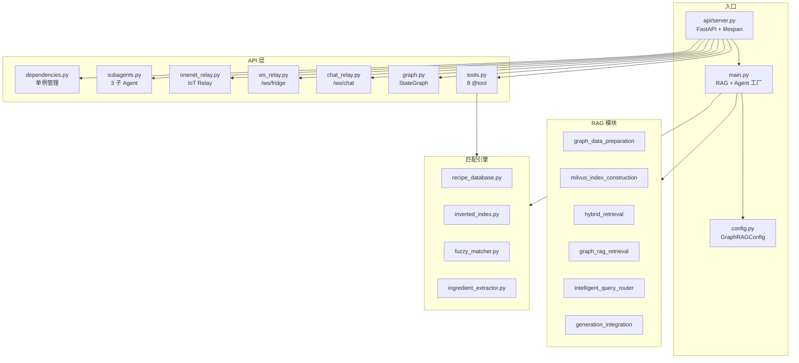

# 开发指南

> FridgeAI 开发者手册 — 代码结构、关键模式、新增功能、测试

## 代码全景图



## 关键设计模式

### 单例模式 (dependencies.py)

模块级全局变量，lifespan 中初始化，通过 getter 函数访问。

### Lifespan 管理初始化 (server.py)

`@asynccontextmanager` 装饰的 lifespan 函数按依赖顺序初始化/清理。

### ToolRuntime 上下文注入 (tools.py)

`@tool` 函数通过 `runtime: ToolRuntime[FridgeContext]` 自动获取冰箱食材和用户偏好。

### Agent 模式选择 (main.py)

`agent_mode` 参数控制三选一：`"basic"` / `"context"` / `"subagents"`。

### WebSocket 并发控制 (chat_relay.py)

`_chat_busy[thread_id]` 标志防止同一对话的消息重叠。

---

## 新增功能

### 新增一个 Tool

1. 在 `api/tools.py` 定义 `@tool` 函数
2. 加入 `FRIDGE_TOOLS_V3` 列表
3. 在 `main.py` system_prompt 添加使用说明
4. 如属子 Agent 领域，更新 `api/subagents.py`

```python
@tool
def search_recipes_by_tag(tag: str, limit: int = 5) -> str:
    """按标签搜索菜谱，如 快手、下饭、宴客"""
    recipes = [r for r in recipe_db.get_all() if tag in r.get("tags", [])]
    return json.dumps(recipes[:limit], ensure_ascii=False)
```

### 新增一个子 Agent

1. 在 `api/subagents.py` 定义 `@tool` 包装函数
2. 内部 `create_agent(model, tools=[...])` 
3. 编写专用 system_prompt
4. 加入 `SUBAGENT_TOOLS` 列表
5. 在 main.py 的 subagents 专用 system_prompt 添加路由规则

### 新增一个 API 路由

1. 在 `api/routes/` 新建文件，创建 `APIRouter`
2. 在 `api/server.py` 注册路由
3. 在 `api/models.py` 添加 Pydantic 模型

---

## 测试

### 测试结构

```
tests/
├── conftest.py          # 全局 fixtures
├── pytest.ini           # 配置 + 标记
├── unit/                # 无外部依赖 (6 个文件)
├── rag/                 # 需 Neo4j + Milvus
├── agent/               # 需 DeepSeek API
├── integration/         # 需运行中服务
└── e2e/                 # 需完整堆栈
```

### 运行测试

```bash
pytest tests/unit/ -v -m unit        # 单元测试
pytest tests/rag/ -v -m rag          # RAG 测试 (需 Neo4j+Milvus)
pytest tests/agent/ -v -m agent      # Agent 测试 (需 API)
pytest -v -m "not slow"              # 跳过慢测试
```

### 测试标记

| 标记 | 依赖 |
|------|------|
| `unit` | 无 |
| `rag` | Neo4j + Milvus |
| `agent` | DeepSeek API |
| `integration` | 运行中服务 |
| `e2e` | 完整堆栈 |
| `slow` | 耗时 |

---

## 代码规范

### Python
- 类型标注：所有函数签名含类型标注
- 环境变量：绝不硬编码凭证
- 日志：`logging.getLogger(__name__)`

### Vue/uni-app
- 缩进：Tab（编辑用 Write 工具，不用 PowerShell）
- 样式：CSS 变量，深色主题色板

### 编辑注意
- 禁止 PowerShell 编辑含中文 .vue/.js
- 子 Agent 模型须带 `httpx.Client(timeout=...)`
- `astream_events(v3)` 非 async iterator → 用 v2 + `anext()`
- uni-app 禁 Vue 字符串 template
- 菜谱元数据可能 float/int → `str()` 转换
