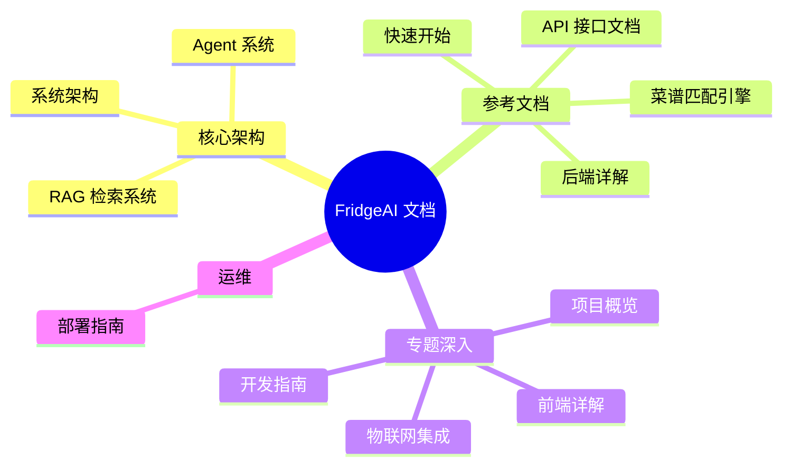

# FridgeAI 技术文档

> 智能冰箱食材管理与菜谱推荐系统 — 完整技术文档
> 更新: 2026-07-17

## 文档导航

按你的角色和目标选择阅读路径：

### 新手入门

1. [项目概览](./01-项目概览.md) — FridgeAI 是什么、能做什么、技术栈
2. [系统架构](./02-系统架构.md) — 6 层架构全景图
3. [快速开始](./03-快速开始.md) — 5 步本地搭建 + Docker 部署
4. [前端详解](./05-前端详解.md) — uni-app 页面与组件

### 后端开发

1. [系统架构](./02-系统架构.md) — 理解整体设计
2. [后端详解](./04-后端详解.md) — FastAPI 路由、依赖注入、生命周期
3. [Agent 系统](./07-Agent系统.md) — 8 Tool + 3 Sub-agent + LangGraph
4. [RAG 检索系统](./09-RAG检索系统.md) — Neo4j + Milvus + 查询路由
5. [菜谱匹配引擎](./08-菜谱匹配引擎.md) — 倒排索引 + 模糊匹配

### 运维部署

1. [部署指南](./11-部署指南.md) — Docker + Nginx + SSL
2. [API 接口文档](./10-API接口文档.md) — REST + WebSocket 完整规范
3. [物联网集成](./06-物联网集成.md) — OneNET + MQTT + ESP32
4. [开发指南](./12-开发指南.md) — 代码结构 + 新增功能流程

---

## 文档结构总览

## 系统一览

| 维度 | 详情 |
|------|------|
| 后端框架 | FastAPI + LangChain + LangGraph |
| 前端框架 | uni-app (Vue 3) 跨平台 |
| AI 模型 | DeepSeek V4 (via OpenAI-compatible API) |
| 向量数据库 | Milvus (HNSW, 512-dim BGE-small-zh) |
| 图数据库 | Neo4j Community (知识图谱) |
| 物联网平台 | OneNET Studio (HTTP 轮询 + MQTT) |
| 菜谱数据 | 323 道菜谱, 12 个分类 |
| 部署方式 | Docker Compose + Nginx |

## 快速链接

- [GitHub 仓库](https://github.com/silver4444-xs/FridgeApp)
- [Swagger API 文档](http://localhost:8000/docs) (启动后端后访问)
- [CLAUDE.md](../CLAUDE.md) — 开发备忘录 (本地, 不上传)
